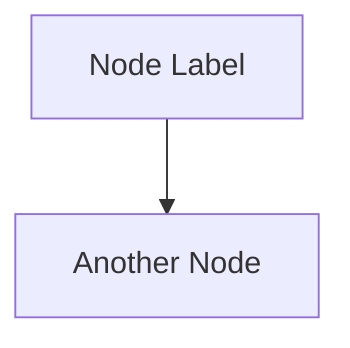
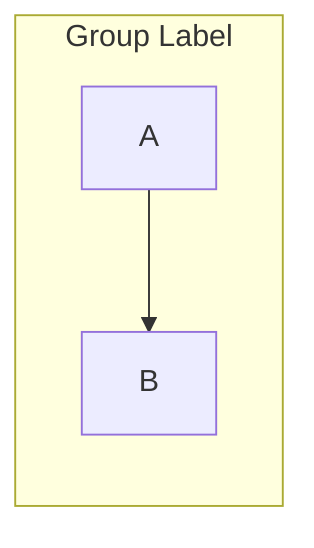

# Career Guidance Authoring

Create comprehensive career guidance knowledge bases for professions, structured as SWEBOK-style Body of Knowledge notes with Thai educational context. Target audience: Thai high school students (ม.ปลาย) and their parents/guidance counselors.

## When to Use

- User wants career guidance notes for a profession (nurse, lawyer, doctor, engineer, pharmacist, teacher, etc.)
- User says "be a ครูแนะแนว" or "guidance counselor"
- User has a `career/` folder in their general-knowledge vault and wants it populated
- User provides a SWEBOK or other BOK as a structure reference
- User wants to know: what students learn, requirements, university recommendations, career paths

## Prerequisites

- Target vault path confirmed (e.g., `F:\obsidian_note\general-knowledge\career\<profession>`)
- Structure reference identified (SWEBOK is the default pattern)
- Scope clarified: depth (comprehensive 8-10 files vs lighter 3-4 files), language (bilingual Thai-English vs English-only)

## Step 1 — Study Existing Vault Patterns

Before creating, read the user's existing vault structure to match formatting:

1. **Read the reference BOK** (e.g., SWEBOK overview + 2-3 chapter files) to understand structure
2. **Read the target vault's existing notes** (e.g., general-knowledge BOK notes) to match style
3. **Note key patterns:**
   - YAML frontmatter format (tags array vs inline, source field, course_codes)
   - Heading hierarchy (## 1 | Section Name vs ### 1.1 Subsection)
   - Table styles (grade band columns, Thai-English terminology pairs)
   - Wikilink conventions (short names vs full paths)
   - Mermaid diagram usage (flowchart, quadrantChart)
   - Language mix (bilingual Thai-English with terminology tables vs English-only)

## Step 2 — Research the Profession

### Research Targets

For Thai professions, research these specific areas:

| Area | What to Find | Sources |
|---|---|---|
| **Regulatory body** | Licensing authority, professional council | เช่น สภาการพยาบาล, สภาทนายความ, แพทยสภา |
| **Degree & duration** | Required degree name, years of study | University websites, council requirements |
| **Curriculum domains** | Major subject areas / knowledge domains | Council curriculum standards, university course catalogs |
| **Admission requirements** | TCAS rounds, required exams, GPA minimums | TCAS website, university admission pages |
| **University rankings** | Top schools, tier classifications, locations | University websites, education rankings |
| **Tuition & scholarships** | Costs by institution type, available scholarships | University fee schedules, scholarship portals |
| **Licensing** | Exam structure, pass rates, renewal requirements | Professional council websites |
| **Career paths** | Work settings, salary ranges, specialization tracks | Job boards, professional associations, MOPH data |
| **International pathways** | Overseas licensing, salary comparisons | Country-specific nursing/medical councils |

### Research Strategy

**Two-pass pattern (preferred):**
1. **Produce from training knowledge first** — the model knows Thai education systems, university rankings, and professional structures well
2. **Verify against web sources** — use Wikipedia API, direct curl to known sites, or targeted searches
3. **Don't burn cycles retrying blocked sites** — many Thai .go.th domains block automated requests

**Web search pitfalls:**
- SearXNG at `search.panomete.com` returns 403 (known issue)
- Thai government domains (.go.th, .or.th) often block curl/automated requests
- Wikipedia API works reliably for general profession overviews
- Google/Bing search via curl is hit-or-miss
- **Fallback:** Training knowledge is often more reliable than blocked web endpoints for Thai education data

**Wikipedia API patterns that work:**
```bash
# Search for pages
curl -s "https://en.wikipedia.org/w/api.php?action=query&list=search&srsearch=QUERY&format=json"

# Get page extract (plain text intro)
curl -s "https://en.wikipedia.org/w/api.php?action=query&prop=extracts&exintro&explaintext&titles=PAGE_TITLE&format=json"

# Get full wikitext (for tables, lists)
curl -s "https://en.wikipedia.org/w/api.php?action=parse&page=PAGE_TITLE&prop=wikitext&format=json"
```

## Step 3 — Design the File Structure

### Standard Career Guidance File Set (Comprehensive)

| # | File | Content Focus |
|---|---|---|
| 🏠 | `Profession - Overview.md` | Profession definition, regulatory framework, education pathway diagram, reading paths |
| **00** | **`00_University_Guide_and_Career_Paths.md`** | **TCAS, universities, tuition, salaries, career ladder — FIRST file students see** |
| 01 | `01_Foundation_Sciences.md` | Prerequisite sciences (anatomy, physiology, chemistry, etc. depending on profession) |
| 02 | `02_Core_Fundamentals.md` | Core profession-specific fundamentals and basic skills |
| 03 | `03_Core_Practice.md` | Main practice domains (e.g., medical-surgical for nursing, civil/criminal for law) |
| 04 | `04_Special_Populations.md` | Special populations or sub-specialties |
| 05 | `05_Community_or_Broader_Context.md` | Community/public health, societal role |
| 06 | `06_Administration_Ethics_Law.md` | Professional ethics, law, management |
| 07 | `07_Clinical_Practice_and_Research.md` | Practicum, evidence-based practice, advanced pathways |

**Critical: University guide is ALWAYS file 00_ (first file).** Students and parents start here — it answers "where do I study and what's the career?" before diving into domain knowledge. Adjust the remaining breakdown to fit the specific profession's knowledge domains — don't force nursing domains onto law.

### File Naming

Use the SWEBOK/General-Knowledge pattern:
- Overview: `Profession Name - Overview.md`
- Chapters: `NN_Topic_Name.md` (two-digit numbering, underscores, English names)
- Place all files in the profession folder: `career/<profession>/`

## Step 4 — Write the Overview File

The overview is the entry point. It follows the SWEBOK overview pattern:

```yaml
---
tags:
  - overview
  - <profession-tag>
  - career
  - health-science (or relevant domain)
  - thai-education
source: "<Regulatory body name>, <Act/Law reference>"
created: YYYY-MM-DD
profession: "<Thai name> (<English name>)"
degree: "<Thai degree name> (<English degree name>)"
duration: "<X ปี (X years)>"
---
```

### Required Sections

1. **Quote block** — Inspirational quote from the profession (both English and Thai if available)
2. **What Is This?** — Purpose of the knowledge base, target audience
3. **Core requirements** — The 3 things needed to practice (education → exam → license)
4. **The N Knowledge Domains** — Numbered list with `[[wikilinks]]` to chapter files, grouped by category with emoji headers
5. **Regulatory Body table** — Key organizations with Thai names and roles
6. **Legal Framework** — Governing act, key sections
7. **Education Pathway Diagram** — Mermaid `flowchart TD` showing the full path from ม.6 → Degree → License → Career → Advanced
8. **Key Terminology table** — Thai/English/Notes
9. **Reading Paths** — Different routes through the material for different users
10. **Related links** — Cross-links to other profession notes and BOK subjects

## Step 5 — Write Domain Chapter Files

Each domain chapter follows this template:

```yaml
---
tags:
  - <profession-tag>
  - <domain-tag>
source: "<Regulatory body> Curriculum Standards"
created: YYYY-MM-DD
domain: "<Domain Name>"
prerequisites: ["[[01_Previous_Chapter]]", "[[02_Another]]"]
---
```

### Body Structure

1. **Quote block** — Relevant quote (Florence Nightingale for nursing, etc.)
2. **Section 1: Core Content** — Tables, lists, hierarchical breakdown
3. **Section 2: Terminology** — Thai/English/Notes table (mandatory in every file)
4. **Section 3+: Detailed subsections** — With clinical/practical context
5. **Mermaid diagrams** — For processes, hierarchies, decision trees
6. **Related Notes** — `[[wikilinks]]` to adjacent chapters

### Content Principles

- **Bilingual Thai-English** — Every file includes a Thai-English terminology table. Headers and body text in English, Thai terms parenthetically or in tables
- **Tables over paragraphs** — Scannable, compare-at-a-glance
- **Practical application** — Every concept connects to what a practitioner actually does
- **Thai context** — Reference Thai regulatory bodies, Thai laws, Thai healthcare/legal system
- **Mermaid diagrams** — For pathways, processes, hierarchies (user prefers Mermaid over ASCII)

### Pitfalls

- **Don't skimp on the university guide (file 00_).** This is what students and parents care about most — TCAS rounds, exam weights, tuition, salaries. Make it comprehensive. It's the FIRST file they see.
- **Don't use tier rankings for universities.** Education doesn't need explicit tiers — just list universities under a single unified section. The order can implicitly reflect reputation (strongest schools first) but don't label them as Tier 1/2/3 or use medal emojis (🥇🥈🥉). Students and parents should see all options without artificial hierarchy.
- **University section naming convention.** The main university section should be named `### <Career> Programs in Thailand` (e.g., "Nursing Programs in Thailand", "Law Programs in Thailand"). NOT "Universities Offering This Program" or "Top X Faculties". Merge any separate university/college subsections (e.g., "Ministry of Public Health Nursing Colleges", "Specialized Colleges", "Rajabhat Universities") into this single unified section — no duplicate headers. All university listings go under one `### <Career> Programs in Thailand` header.
- **Don't skip terminology tables.** Bilingual tables in every file are the user's established pattern.
- **Don't guess university order.** Verify against known Thai universities. The top schools are well-known and consistent across sources. List all universities that offer the program without explicit tier labels.
- **Don't forget the profession-specific regulatory framework.** Every Thai profession has a governing council (สภา) — find it and cite the act.
- **Don't use em-dashes (—) in content.** Use colons (:) per user preference.
- **🚨 NEVER use `graph TD/LR/BT` in Mermaid diagrams.** Obsidian's current Mermaid renderer rejects or misrenders `graph`. Always use `flowchart TD/LR/BT`. If user reports "syntax error" in a diagram, this is the first thing to check. After creating all files, run a verification sweep: `grep -rn "^graph " "F:/obsidian_note/general-knowledge/career/" --include="*.md"` — any hits must be batch-fixed with: `find . -name "*.md" -exec sed -i 's/^graph TD$/flowchart TD/g; s/^graph BT$/flowchart BT/g; s/^graph LR$/flowchart LR/g; s/^graph RL$/flowchart RL/g' {} +`
- **🚨 NEVER put unescaped parentheses `()` inside Mermaid node labels.** Mermaid uses `()` for round-rectangle node shapes, so `[\"Label (with parens)\"]` confuses the parser and produces \"unsupported markdown: list\" errors. Replace `(` with `&#40;` and `)` with `&#41;` — these HTML entities render as `(` and `)` visually but don't break Mermaid. Batch-fix with `scripts/fix-mermaid-parens.py`.\n- **🚨 NEVER put dots after numbers in Mermaid node labels** like `[\"1. Assessment\"]`. The `.` confuses Mermaid's parser (it tries to parse as numbered list). Remove the dot: `[\"1 Assessment\"]`. Batch-fix: inside Mermaid blocks, `sed -E 's/([0-9]+)\\.\\s/\\1 /g'`.\n- **🚨 NEVER put bare ampersands `&` in Mermaid node labels** like `[\"Research & Define\"]`. Mermaid treats `&` as an HTML special character. Replace with `and`. This includes `R&D` → `R and D`. Batch-fix: inside Mermaid blocks, replace ` & ` → ` and `.

### Table Merge Pattern (University Tables)

When university listings exist as multiple separate tables (e.g., from removed tiers), merge them into one unified table:

1. **Detect column structures** — Tables may have 5, 4, 3, or 2 columns
2. **Skip year columns** — If a cell is 4 digits, it's an "Est." (established) year — skip it
3. **Standardize to 4 columns** — University | Faculty | Location | Notable Features
4. **Remove duplicates** — Keep first occurrence of each university
5. **Use dash (-) for empty cells** — Don't leave cells blank

**Batch-fix script:** `scripts/merge-university-tables.py` handles this automatically:
```bash
python3 scripts/merge-university-tables.py F:/obsidian_note/general-knowledge/career/nurse
```

## Step 8 — Fill Missing Faculty Names

After merging tables, many universities will have "-" for faculty. Fill these systematically:

```bash
# Fill all careers at once
python3 scripts/fill-faculty-names.py --all F:/obsidian_note/general-knowledge/career

# Or fill a single career
python3 scripts/fill-faculty-names.py F:/obsidian_note/general-knowledge/career/nurse
```

The script uses:
1. **Explicit mappings** — Known faculty names for specific universities (in `FACULTY_MAP` dict)
2. **Generic fallback** — Default faculty name for the profession (e.g., `คณะพยาบาลศาสตร์` for nursing)

### Adding New Faculty Mappings

When encountering a university not in the explicit map, add it to `FACULTY_MAP` in `scripts/fill-faculty-names.py`:

```python
'nurse': {
    'New University': 'คณะพยาบาลศาสตร์',  # Add here
}
```

### Common Thai Faculty Names by Profession

| Profession | Faculty Name (Thai) |
|---|---|
| Nursing | คณะพยาบาลศาสตร์ |
| Psychology | คณะจิตวิทยา / สาขาวิชาจิตวิทยา |
| Education | คณะครุศาสตร์ / คณะศึกษาศาสตร์ |
| Engineering | คณะวิศวกรรมศาสตร์ |
| Law | คณะนิติศาสตร์ |
| Agriculture | คณะเกษตรศาสตร์ |
| Accounting | คณะพาณิชยศาสตร์และการบัญชี / คณะบัญชี |

### Regex Pattern for Variable Whitespace

Table rows often have inconsistent spacing. Use this regex pattern:

```python
pattern = r'(\| \*\*' + re.escape(uni_name) + r'\*\*\s+)\| -\s+\|'
replacement = f'| **{uni_name}** | {faculty} |'
```

The `\s+` handles variable whitespace between columns.

## Step 7 — Create source.md (Source Reference File)

After creating all guidance files, create a `source.md` file in the career folder. This centralizes all source links for verification and maintenance.

### source.md Structure

```markdown
# [Career] Sources

> **Purpose:** Central reference for all source links used in the [Career] career guidance notes.
> **How to use:** Verify links periodically. Update this file when sources change.

---

## University Program Links

> **Note:** Some university websites may only be accessible from within Thailand. Links marked ✅ were verified accessible; others may need verification from a Thai IP.

### Verified Accessible

| University | Faculty | URL |
|---|---|---|
| **University Name** | คณะ... | https://... ✅ |

### Needs Verification (may require Thai IP)

| University | Faculty | URL |
|---|---|---|
| **University Name** | คณะ... | https://... |

---

## TCAS & Admission

| Source | Description | URL |
|---|---|---|
| **TCAS Official** | Thai University Central Admission System | https://www.mytcas.com ✅ |
| **NIETS** | National Institute of Educational Testing Service (TGAT/TPAT/A-Level) | https://www.niets.or.th ✅ |

### TCAS Exam Weights (as of YYYY)

> **⚠️ Verify annually** — weights may change each admission cycle.

| Exam | Typical Weight | Source |
|---|---|---|
| **TGAT** | XX–XX% | NIETS |
| **TPAT X** | XX–XX% | NIETS |
| **A-Level ...** | XX–XX% | NIETS |

**Note:** Exact weights vary by university. Check each university's TCAS announcement.

---

## Professional Licensing

| Source | Description | URL |
|---|---|---|
| **Council Name** | สภา... — licensing, exam, standards | https://... ✅ |

### Licensing Requirements (verify against council)

| Requirement | Details | Source |
|---|---|---|
| **Degree** | ... | Council accreditation list |
| **Exam** | ... | Council exam announcement |
| **License renewal** | ... | Council regulations |

---

## Career & Salary Data

| Source | Description | URL |
|---|---|---|
| **Department of Labour** | Salary surveys, minimum wage | https://www.mol.go.th |
| **JobThai** | Private sector salary ranges | https://www.jobthai.com |
| **LinkedIn Salary** | Salary insights | https://www.linkedin.com/salary |

---

## Scholarships

| Scholarship | Sponsor | URL |
|---|---|---|
| **Scholarship Name** | Sponsor | https://... |

---

## Curriculum & Standards

| Source | Description | URL |
|---|---|---|
| **Council Curriculum Standards** | Degree curriculum requirements | https://... |
| **Thai Qualifications Framework (TQF)** | National qualification standards | https://www.eqa.or.th |
| **Office of Higher Education** | Higher education policy | https://www.mhesi.go.th |

---

## Last Verified

| Item | Date | Verified By |
|---|---|---|
| Council website | YYYY-MM-DD | System check |
| TCAS website | YYYY-MM-DD | System check |
| University URLs | YYYY-MM-DD | Partial (see ✅ marks) |
| Salary data | Unverified | — |
| Scholarship links | Unverified | — |

---

> **How to verify:** Open each link in your browser from Thailand. If a link is broken, search for the university name + faculty name on Google to find the current URL.
```

### Workflow Integration

The source.md file serves as the **first step** before updating guidance notes:

1. **Create source.md** — gather all official links for the career
2. **User verifies links** — check from Thai IP, mark verified with ✅
3. **Use verified sources** to update/verify guidance note content
4. **Add "See [[source]] for verification links"** note to each guidance file

### Key Sources to Include

| Category | What to Link |
|---|---|
| **University program pages** | Direct link to faculty/program page (one per university) |
| **TCAS/Admission** | TCAS search page, NIETS exam pages |
| **Professional licensing** | Council website, exam info, license verification |
| **Career/Salary** | Department of Labour, job boards |
| **Scholarships** | Government scholarships, university scholarships |
| **Curriculum standards** | Council curriculum requirements, TQF |

## Step 9 — Verify and Report

### Mermaid Syntax Verification (MANDATORY)

Before reporting "done", run this sweep across ALL career files:

```bash
# Check for deprecated graph syntax
grep -rn "^graph " "F:/obsidian_note/general-knowledge/career/" --include="*.md"

# If ANY results, batch-fix immediately:
cd "F:/obsidian_note/general-knowledge/career" && \
  find . -name "*.md" -exec sed -i \
    's/^graph TD$/flowchart TD/g; s/^graph BT$/flowchart BT/g; \
     s/^graph LR$/flowchart LR/g; s/^graph RL$/flowchart RL/g' {} +

# Verify zero remaining
grep -rn "^graph " "F:/obsidian_note/general-knowledge/career/" --include="*.md" | wc -l  # must be 0
```

### Final Report

- List all created files with sizes
- Confirm wikilinks resolve correctly (cross-reference overview links to actual file names)
- Report total file count and KB to user
- Offer to proceed with the next profession

## Verified Professions Built (July 2026)

| Profession | Files | Size | Verified By | Key Distinction |
|---|---|---|---|---|
| 🩺 **Nurse** | 9 files + source.md | ~80 KB | ✅ Professional nurse review — confirmed accurate | 4-year B.N.S. → license exam → RN; source.md created with verified URLs |
| 🧠 **Psychologist** | 8 files | ~83 KB | ⏳ Awaiting psychologist review | 4-year B.Sc./B.A. + 2-year M.Sc. = 6 years for clinical track |
| 🍎 **Teacher** | 8 files | ~84 KB | ✅ Built this session | 4-5 year B.Ed. → license exam (คุรุสภา) → 5-year renewal |
| ⚙️ **Engineer** | 8 files | ~75 KB | ✅ Built this session | 4-year B.Eng. → สภาวิศวกร license levels (ภาคี→สามัญ→วุฒิ); science-math track only |
| 🌾 **Agriculture** | 7 files | ~55 KB | ✅ Built this session | 4-year B.Sc. Agriculture; NO single governing license for most roles; Pattern E |
| 📊 **Accountant** | 7 files | ~55 KB | ✅ Built this session | 4-year B.Acc. → CPA exam (5 papers, ~30-50% pass rate) + 3 years audit experience; Pattern F |
| **Total** | **7 professions** | **55 files** | **~511 KB** | |

### Education Pathway Patterns Learned

Four distinct education pathway patterns emerged:

**Pattern A: Direct Bachelor's → License** (Nurse, Teacher)
- 4-year bachelor's degree → licensure exam → professional license
- Bachelor's includes all required clinical/practicum hours
- Example: B.N.S. → สภาการพยาบาล exam → Registered Nurse

**Pattern B: Bachelor's + Master's → License** (Psychologist — Clinical Track)
- 4-year bachelor's (foundation) + 2-year master's (clinical specialization)
- Clinical hours concentrated in master's program
- Non-clinical careers possible with bachelor's alone (HR, research, education)
- Must clearly distinguish clinical vs. non-clinical paths in the overview

**Pattern C: Bachelor's → Multiple Career Tracks** (Lawyer)
- Single LL.B. degree feeds into 3+ distinct career tracks with different selection processes:
  - Lawyer: pass Lawyers Council training + exam → ทนายความ license
  - Prosecutor: pass competitive OAG exam → civil service → อัยการ
  - Judge: pass competitive Judicial Commission exam → civil service → ผู้พิพากษา
- Also includes in-house counsel track (นิติกร) requiring no license
- Overview must include a Mermaid diagram showing ALL tracks with their separate entry gates
- Licensure is tied to the track, not a single profession-wide license
- เนติบัณฑิต (Barrister-at-Law) is optional for lawyers but REQUIRED for judge/prosecutor
- Thailand is a CIVIL LAW system — primary authority is written codes; Supreme Court decisions are persuasive but not formally binding precedent
- Entry is accessible: accepts ALL ม.6 tracks (Science, Arts, Vocational); no math/science requirements
- Admission emphasis on language (Thai + English) and analytical skills rather than science/math

**Pattern E: Broad Profession, No Single Governing License** (Agriculture)
- 4-year B.Sc. Agriculture with multiple sub-disciplines (agronomy, animal science, aquaculture, food science, agribusiness)
- NO single mandatory professional license for most career paths
- Some certifications exist (organic certification auditor, food safety auditor) but are optional/specialized
- Career paths span: farming, agribusiness, food processing, AgriTech, research, government extension
- The field is transforming: smart farming, BCG Economy, carbon credits create new career types
- Major employers are corporations (CP Group, Thai Union, Mitr Phol) rather than licensed practice
- King Rama IX's Sufficiency Economy / New Theory Agriculture is a unique Thai context element
- TCAS admission: science track preferred but not always required for some programs
- Kasetsart University is THE premier agricultural university (4 separate agriculture-related faculties)

**Pattern F: Hard Exam + Corporate Pipeline** (Accountant)
- 4-year B.Acc. → CPA exam (5 papers, ~30-50% pass rate) + 3 years audit experience → CPA license
- CPA exam is significantly harder than most professional licensing exams
- Big 4 firms (PwC, Deloitte, EY, KPMG) are the primary career pipeline for CPAs
- Multiple credential paths: CPA (audit), CMA (management), CIA (internal audit), CFE (forensic), CFA (finance)
- TFRS = IFRS aligned — Thai accounting is internationally compatible
- Tax is a major specialization with its own exam (Tax Auditor — สรรพากร)
- Forensic accounting is a growing niche (fraud investigation, litigation support)
- Entry is accessible: accepts ALL tracks; math proficiency is key

**Pattern D: Broad Profession with Many Sub-Disciplines** (Engineer)
- 4-year B.Eng. with shared foundation (Year 1-2) → specialization (Year 3-4)
- 6+ distinct sub-disciplines each deserve their own chapter file
- License levels (ภาคี→สามัญ→วุฒิ) apply differently per field
- Some fields are "controlled engineering" requiring a license; others (software, telecom) are not
- TCAS admission REQUIRES science-math track (unlike law/psychology which accept all tracks)
- Emerging fields (robotics, aerospace, biomedical) should get a dedicated chapter
- Washington Accord: Thai B.Eng. degrees recognized in 20+ countries

## Research Strategies (Refined)

### SearXNG Block (Persistent)
- **SearXNG MCP at `search.panomete.com` consistently returns 403** — do not retry more than once. This has been true across multiple sessions.
- **Wikipedia API is the most reliable web source** — use `action=query&prop=extracts&explaintext` for overviews, `action=query&list=search` to find pages.
- **Training knowledge is often MORE reliable than blocked .go.th domains** — especially for Thai regulatory bodies, university rankings, and curriculum structures.
- **Direct curl to known sites** — tnmc.or.th returned usable Thai text. Most .go.th and .ac.th domains block automated requests.

### Verification Signal
- The nurse guide was passed to a professional nurse who **confirmed it as accurate** — this validates the approach of using training knowledge + Wikipedia verification for Thai career guidance content.

## References

- `references/nursing-source-md-example.md` — Complete source.md for nursing as a worked example. Use as template for other professions.

- `references/thai-university-faculty-names.md` — Complete mapping of Thai university faculty names by profession. Use when filling missing faculty data or adding new universities.
- See `references/nursing-career-guide-example.md` for the complete nurse career guide as a worked example — the first profession built, verified as accurate by a professional nurse.
- See `references/psychologist-career-guide-example.md` for the psychologist guide — demonstrates Pattern B (bachelor's + master's pathway for clinical practice).
- See `references/teacher-career-guide-example.md` for the teacher guide — demonstrates Thai civil service career ladder (วิทยฐานะ) and Rajabhat university system.
- See `references/engineer-career-guide-example.md` for the engineer guide — demonstrates Pattern D (broad profession with many sub-disciplines, Washington Accord, EEC context).
- See `references/lawyer-career-guide-example.md` for the lawyer guide — demonstrates Pattern C (multiple career tracks from single degree, civil law system).
- See `references/agriculture-career-guide-example.md` for the agriculture guide — demonstrates Pattern E (broad profession, no single governing license, BCG Model, Sufficiency Economy context).
- See `references/accountant-career-guide-example.md` for the accountant guide — demonstrates Pattern F (hard CPA exam, Big 4 pipeline, TFRS = IFRS, multiple credential paths).
- **Fix scripts:** `scripts/fix-mermaid-parens.py` (parentheses → HTML entities), `scripts/fix-mermaid-dots.py` (remove dots after numbers), `scripts/fix-mermaid-ampersands.py` (bare & → and) — run all three as a post-creation sweep.
- **Table merge script:** `scripts/merge-university-tables.py` — merges multiple university tables with different column structures into one unified table. Usage: `python3 scripts/merge-university-tables.py <career_folder>`
- SWEBOK vault at `F:\\obsidian_note\\swe-knowledge\\body-of-knowledge\\SWEBOK` — the reference structure pattern
- General-knowledge BOK at `F:\\obsidian_note\\general-knowledge\\body-of-knowledge` — the formatting pattern for Thai-education notes
- Completed career guides at `F:\\obsidian_note\\general-knowledge\\career\\` — nurse, psychologist, teacher, engineer, lawyer, agriculture, accountant

## Mermaid Best Practices (CRITICAL)

### 1. Always use `flowchart`, never `graph`
Obsidian's Mermaid renderer has deprecated `graph` — it causes silent rendering failures or visible syntax errors.

**Correct:**


**Wrong (deprecated):**


### 2. NEVER put unescaped parentheses `()` inside node labels
Mermaid uses `()` for round-rectangle node shapes. When a label like `["Exam (8 subjects)"]` appears, Mermaid tries to parse `(8 subjects)` as shape syntax → "unsupported markdown: list" error.

**Wrong:**
```
A["National Licensure Exam (8 subjects)"]
```

**Correct:**
```
A["National Licensure Exam &#40;8 subjects&#41;"]
```

HTML entities `&#40;` and `&#41;` render as `(` and `)` visually but don't break the parser.

**Batch-fix script:** `scripts/fix-mermaid-parens.py` walks all `.md` files, finds Mermaid blocks, and replaces `()` in labels with HTML entities.

### 3. Subgraph syntax (correct)


### 4. Dots after numbers break labels (NEW — discovered July 2026)

Mermaid misinterprets `"1. Assessment"` as list syntax. Remove the dot.

**Wrong:**
```
A["1. Assessment<br/>การประเมิน"] --> B["2. Diagnosis<br/>การวินิจฉัย"]
```

**Correct:**
```
A["1 Assessment<br/>การประเมิน"] --> B["2 Diagnosis<br/>การวินิจฉัย"]
```

### 5. Ampersands `&` break labels (NEW — discovered July 2026)

Mermaid treats bare `&` as an HTML special character. Replace with `and`.

**Wrong:**
```
A[Research & Define]
```

**Correct:**
```
A[Research and Define]
```

Includes `R&D` → `R and D`.
### Batch-fix commands (post-creation verification sweep)

```bash
# Fix 1: Replace deprecated graph with flowchart
cd "F:/obsidian_note/general-knowledge/career" && \
  find . -name "*.md" -exec sed -i \
    's/^graph TD$/flowchart TD/g; s/^graph BT$/flowchart BT/g; \
     s/^graph LR$/flowchart LR/g; s/^graph RL$/flowchart RL/g' {} +

# Fix 2: Replace parentheses in Mermaid labels with HTML entities
python3 scripts/fix-mermaid-parens.py

# Fix 3: Remove dots after numbers inside Mermaid labels
python3 scripts/fix-mermaid-dots.py

# Fix 4: Replace bare ampersands inside Mermaid labels with "and"
python3 scripts/fix-mermaid-ampersands.py

# Fix 5: Merge multiple university tables into one unified table
python3 scripts/merge-university-tables.py F:/obsidian_note/general-knowledge/career/nurse

# Fix 6: Fill missing faculty names in university tables
python3 scripts/fill-faculty-names.py --all F:/obsidian_note/general-knowledge/career
```

**Recommended workflow:** Run fixes 1-4 as a sweep, then fix 5 (merge), then fix 6 (faculty fill). The merge must happen before faculty fill because the fill script operates on the merged table.
