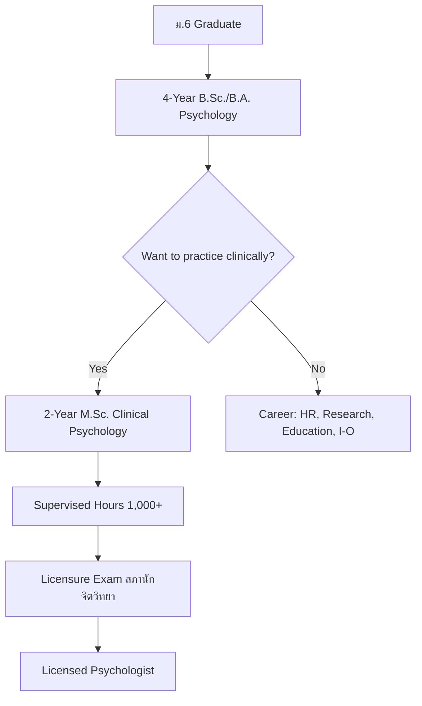

# Psychologist Career Guide — Reference

Built July 2026, 8 files, ~83 KB.

## Key Structural Decision: Clinical vs. Non-Clinical Split

Psychology is the first profession built that requires a **master's degree for clinical practice** (Pattern B: Bachelor's + Master's → License). This affects the Overview's education pathway diagram, which must show TWO tracks.

### Education Pathway (Mermaid)



### File Structure

| File | Content |
|---|---|
| `Psychologist - Overview.md` | Psychologist vs. psychiatrist distinction, Psychology Profession Act B.E. 2560, 5 license categories |
| `01_Foundations_of_Psychology.md` | 5 pillars: Biological, Cognitive, Developmental, Social, Personality + Big Five OCEAN + history timeline |
| `02_Psychological_Assessment_and_Diagnosis.md` | Psychometrics, IQ (WAIS, WISC, Raven's), MMPI, Rorschach, DSM-5-TR, Mental Status Exam |
| `03_Clinical_Psychology.md` | Biopsychosocial model, disorder categories with differential diagnosis table, CBT/Psychodynamic/Humanistic/Family therapy, suicide risk |
| `04_Counseling_Psychology.md` | Person-Centered, MI, SFBT, Career Counseling (RIASEC), Grief, Crisis, Group (Yalom) |
| `05_Applied_Psychology_Specialties.md` | I-O, Educational, Health, Forensic, Sports, Community, Neuropsychology, Positive Psychology (PERMA) |
| `06_Research_Methods_and_Ethics.md` | Experimental through meta-analysis, statistics, replication crisis, APA + Thai Psychology Council ethics |
| `07_University_Guide_and_Career_Paths.md` | TCAS (TGAT-heavy, no TPAT for most programs), 15+ universities in 3 tiers + clinical training institutes, 12 settings with salaries, clinical + non-clinical career ladders |

### Thai-Specific Content
- Psychology Profession Act B.E. 2560 — the 2017 law that first regulated psychology in Thailand
- สภานักจิตวิทยา (Psychology Council) — established under this act
- 5 license categories: Clinical, Counseling, I-O, Developmental, Community
- Thai-normed tests: WAIS-IV Thai, WISC-V Thai
- Thai cultural notes: filial piety, intergenerational households, Buddhist concepts

### Key Terminology Pattern
Every file ends with a Thai-English terminology table:
```markdown
| Thai | English | Notes |
|---|---|---|
| นักจิตวิทยาคลินิก | Clinical Psychologist | Assess and treat mental disorders |
```

### "Is This Right for You?" Pattern
The university guide ends with a two-column table:
```markdown
| ✅ You'll thrive if you... | ⚠️ Consider carefully if you... |
|---|---|
```
