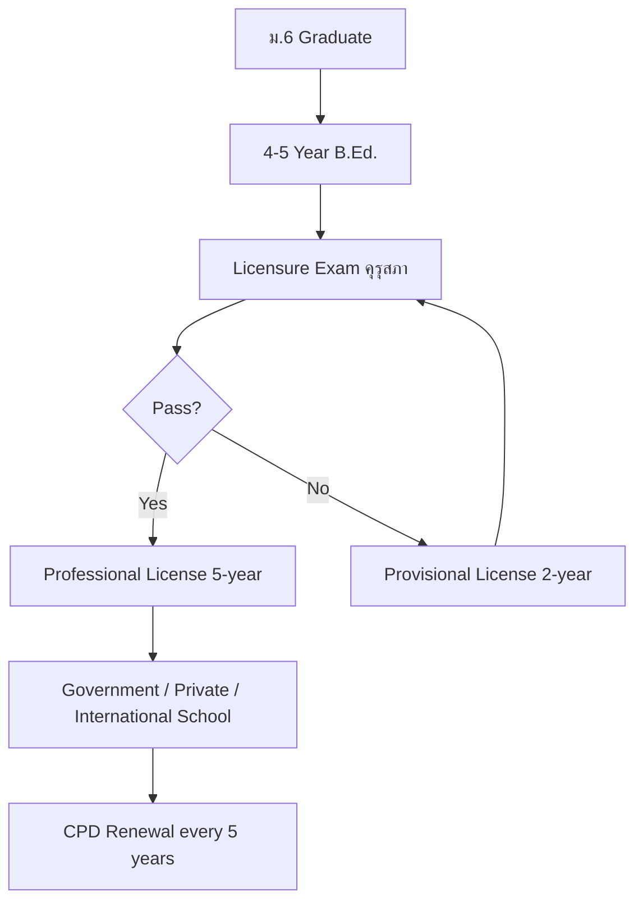

# Teacher Career Guide — Reference

Built July 2026, 8 files, ~84 KB.

## Key Structural Decision: Civil Service Career Ladder

Teaching is the first profession built that has a **government civil service career ladder (วิทยฐานะ)** with distinct ranks and salary bands. This affects the University Guide's career progression section significantly.

### Education Pathway (Mermaid)



### File Structure

| File | Content |
|---|---|
| `Teacher - Overview.md` | Teachers' Council Act B.E. 2546, คุรุสภา, 3 professional standards, license types, school types |
| `01_Foundations_of_Education.md` | 5 philosophies + Thai philosophy, global + Thai history (Sukhothai→present), sociology, Thai education system, 8 learning areas |
| `02_Curriculum_and_Instruction.md` | Thai Core Curriculum (competencies, desired characteristics), Tyler/Taba/Backward Design, 10+ teaching methods, lesson plan anatomy, Bloom's Taxonomy |
| `03_Developmental_and_Learning_Psychology.md` | Piaget, Vygotsky (ZPD), Erikson, behaviorism→cognitivism→constructivism, SDT, Growth Mindset, Attribution theory |
| `04_Classroom_Management_and_Assessment.md` | Physical + psychological environment, 7 management models, behavior hierarchy, assessment types, rubrics, Thai grading system |
| `05_Educational_Technology_and_Innovation.md` | SAMR, TPACK, 10 tool categories + Thai platforms, Mayer's principles, STEM/STEAM, digital citizenship |
| `06_Special_Education_and_Inclusive_Practices.md` | Thai disability laws, inclusion continuum, LD/ID/ASD/ADHD, IEP process, UDL 3 principles |
| `07_University_Guide_and_Career_Paths.md` | TCAS + TPAT 5, 20+ universities in 3 tiers + Rajabhat, subject-specific programs, licensing exam, 9 settings with salaries, วิทยฐานะ ladder (คศ.1→คศ.5) |

### Thai-Specific Content
- Teachers' Council Act B.E. 2546 — established คุรุสภา
- 3 professional standards: Knowledge (11 areas), Experience (1 year practicum), Performance (12 standards)
- License types: Professional A (5yr), Provisional B (2yr), Administrative, Supervisor
- วิทยฐานะ system: ครูผู้ช่วย → คศ.1 → คศ.2 → คศ.3 → คศ.4 → คศ.5
- 8 Thai learning areas (กลุ่มสาระการเรียนรู้)
- 8 desired characteristics (คุณลักษณะอันพึงประสงค์)
- King Rama IX's Sufficiency Economy Philosophy integrated into curriculum
- Rajabhat Universities (40+ campuses) as primary teacher trainers
- "ครูคืนถิ่น" programs for rural teacher recruitment

### University Tiers (Unique to Teaching)
- Tier 1: Chulalongkorn, Kasetsart, มศว (historically THE premier teaching university), Thammasat, CMU
- Tier 2: KKU, PSU, Burapha, Naresuan, Silpakorn, Mahasarakham, Thaksin
- Tier 3: Rajabhat Universities (40+ campuses) — most Thai teachers graduate from here

### Key Terminology Pattern
```markdown
| Thai | English | Notes |
|---|---|---|
| ครู | Teacher | Licensed professional educator |
| คุรุสภา | Teachers' Council of Thailand | Licensing body |
```

### Teaching-Specific "Is This Right for You?" Traits
Added teaching-specific traits not found in other guides:
- "Love working with children/young people"
- "Are patient — very, very patient"
- "Enjoy explaining things in different ways"
- "Care about social justice and equal opportunity"
- "Want a stable career with benefits and pension"
- Counterpoint: "Want to get rich quickly" — honest about salary reality
