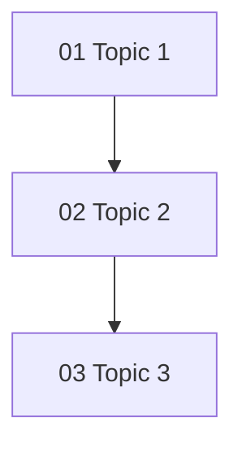
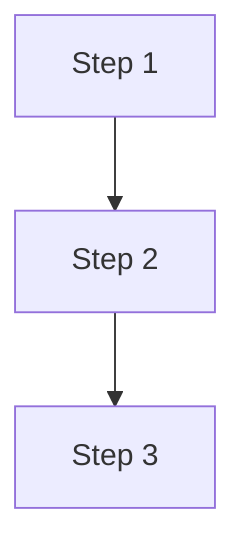

# Career Path Overlay — File Templates

## Capability Area Overview Template (00_overview.md)

```markdown
---
title: "Capability Area Name"
note_type: capability-area-overview
capability_area: capability-slug
career_path: senior-software-engineer
source_frameworks:
  - "[[SWEBOK v4 - Overview]]"
  - "[[SEBoK v2 - Overview]]"
tags:
  - career-path
  - senior-engineer
  - capability-area
  - overview
---

# Capability Area Name

> **Core idea:** One-sentence summary of what this capability means at senior level.

## What This Capability Means at Senior Level

Two to three paragraphs explaining why this capability distinguishes senior from mid-level. Focus on judgment, accountability, and decision-making.

## Topic Notes

| # | Topic | Focus | Status | File |
|---|---|---|---|---|
| 01 | Topic Name 1 | One-line focus | ✅ Done | `01_Topic_Name_1.md` |
| 02 | Topic Name 2 | One-line focus | ✅ Done | `02_Topic_Name_2.md` |
| 03 | Topic Name 3 | One-line focus | 🚧 In Progress | `03_Topic_Name_3.md` |

**Completion:** 2/3 — 67%

## How the Topics Connect



**Reading order:** Brief explanation of the recommended reading sequence.

## Existing Vault Anchors

These topic notes **do not duplicate** the existing knowledge base. They layer senior-level application on top of it:

| Senior topic | Existing foundation notes |
|---|---|
| Topic 1 | [[existing-note-1]] |
| Topic 2 | [[existing-note-2]] |
| Topic 3 | [[existing-note-3]] |

## Self-Assessment Checklist

Use this to gauge your current level in this capability:

- [ ] Question 1 (specific, observable behavior)
- [ ] Question 2 (specific, observable behavior)
- [ ] Question 3 (specific, observable behavior)
- [ ] Question 4 (specific, observable behavior)
- [ ] Question 5 (specific, observable behavior)
- [ ] Question 6 (specific, observable behavior)
- [ ] Question 7 (specific, observable behavior)
- [ ] Question 8 (specific, observable behavior)

## Related

- [[00_overview|Senior Software Engineer Overview]]
- [[adjacent-capability-area/00_overview|Adjacent Capability Area]]
- [[career-path/03_Staff_Engineer/00_overview|Staff Engineer]] — how this capability expands at the next level
```

## Topic Note Template

```markdown
---
title: "Topic Name"
note_type: capability-topic
capability_area: capability-slug
career_path: senior-software-engineer
prerequisite:
  - "[[01_Previous_Topic]]"
tags:
  - career-path
  - senior-engineer
  - capability-area
  - topic-name
---

# Topic Name

> **One-line definition:** Concise definition of what this topic means at senior level.

## Why This Is a Senior Skill

Two to three paragraphs explaining:
- What a mid-level engineer does (baseline)
- What a senior engineer does differently (judgment, accountability, decision-making)
- Why this distinction matters

## Core Frameworks

### Framework 1 Name

Brief explanation of the framework.

| Column 1 | Column 2 | Column 3 |
|---|---|---|
| Row 1 | Data | Data |
| Row 2 | Data | Data |

### Framework 2 Name

Brief explanation with a table, checklist, or decision matrix.



### Framework 3 Name

Brief explanation with a comparison table, process flow, or template.

## In Practice

### Practice Area 1

How to apply this in real projects. Include workshop agendas, review checklists, or facilitation guides.

**Workshop agenda (60-90 minutes):**

1. **Activity 1** (15 min): Description
2. **Activity 2** (20 min): Description
3. **Activity 3** (20 min): Description
4. **Activity 4** (15 min): Description

### Practice Area 2

How to handle common challenges or anti-patterns.

| Anti-pattern | Description | What to do instead |
|---|---|---|
| Anti-pattern 1 | Description | Alternative approach |
| Anti-pattern 2 | Description | Alternative approach |

### Practice Area 3

How to manage changes or updates (e.g., when assumptions change, when priorities shift).

## Practical Exercise

**Take your current project and:**

1. **Step 1:** Specific action to take
2. **Step 2:** Specific action to take
3. **Step 3:** Specific action to take
4. **Step 4:** Specific action to take
5. **Step 5:** Specific action to take

**Bonus:** Retrospective exercise to apply this to a past project.

## Knowledge Connections

- [[01_Previous_Topic]] — How this topic connects to the previous one
- [[03_Next_Topic]] — How this topic connects to the next one
- [[existing-bok-note-1]] — Foundational knowledge from SWEBOK/BABOK
- [[existing-bok-note-2]] — Foundational knowledge from SWEBOK/BABOK
- [[existing-bok-note-3]] — Foundational knowledge from SWEBOK/BABOK

## Key Takeaways

- Takeaway 1: Concise statement of the most important idea
- Takeaway 2: Concise statement with actionable advice
- Takeaway 3: Concise statement with a specific technique
- Takeaway 4: Concise statement with a warning or pitfall
- Takeaway 5: Concise statement with a best practice
- Takeaway 6: Concise statement summarizing the senior-level mindset
```

## YAML Frontmatter Patterns

### Capability Area Overview

```yaml
---
title: "Capability Area Name"
note_type: capability-area-overview
capability_area: capability-slug
career_path: senior-software-engineer
source_frameworks:
  - "[[SWEBOK v4 - Overview]]"
  - "[[SEBoK v2 - Overview]]"
tags:
  - career-path
  - senior-engineer
  - capability-area
  - overview
---
```

### Topic Note

```yaml
---
title: "Topic Name"
note_type: capability-topic
capability_area: capability-slug
career_path: senior-software-engineer
prerequisite:
  - "[[01_Previous_Topic]]"
tags:
  - career-path
  - senior-engineer
  - capability-area
  - topic-name
---
```

## Common Framework Tables

### Comparison Table (Mid-level vs Senior)

| Aspect | Mid-level approach | Senior approach |
|---|---|---|
| Aspect 1 | What they do | What you do differently |
| Aspect 2 | What they do | What you do differently |
| Aspect 3 | What they do | What you do differently |

### Decision Matrix

| Criterion | Weight | Option A | Option B | Option C |
|---|---|---|---|---|
| Criterion 1 | High | Good | Fair | Excellent |
| Criterion 2 | Medium | Excellent | Good | Fair |
| Criterion 3 | Low | Fair | Excellent | Good |

### Checklist Template

```markdown
## Checklist Name

### Category 1
- [ ] Item 1
- [ ] Item 2
- [ ] Item 3

### Category 2
- [ ] Item 4
- [ ] Item 5
- [ ] Item 6
```

### Risk Register Template

| ID | Risk | Category | Probability | Impact | Risk level | Mitigation | Owner | Status |
|---|---|---|---|---|---|---|---|---|
| R-001 | Risk description | Category | High/Med/Low | High/Med/Low | Critical/High/Medium/Low | Mitigation strategy | Name | Open/Mitigating/Closed |

### Evidence Log Template

```markdown
## Evidence Log: [Your Name]

### YYYY-QN

**Outcomes:**
- Outcome 1 with metrics
- Outcome 2 with metrics

**Decisions:**
- Decision 1 with rationale and outcome
- Decision 2 with rationale and outcome

**Problem Prevention:**
- Risk identified and mitigated
- Risk identified and mitigated

**Influence:**
- Mentoring outcome
- Process improvement

**Artifacts:**
- ADR-NNN
- Design document
- Post-mortem
```

## Verification Commands

```bash
# Check for em-dashes (should be zero)
grep -c '—' *.md

# Check for ASCII trees (should be zero)
grep -c '[├└│─]' *.md

# Check for deprecated Mermaid graph syntax
grep -rn "^graph " . --include="*.md"

# Verify all wikilinks resolve
grep -o '\[\[.*\]\]' *.md | sort -u

# Count Mermaid diagrams
grep -c '```mermaid' *.md

# Total file size
wc -c *.md
```
