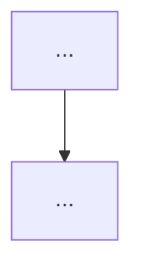

# Career and Technology Topic-Filling Pattern

## Scope

Use this pattern when the existing Thai Career and Technology overview already contains concrete wikilinks and the user asks to fill them in a separate content root. The reference implementation used the Social Studies folder pattern and created:

- 5 strand overview files
- 22 topic files
- 4 grade bands in every topic: ป.1–3, ป.4–6, ม.1–3, ม.4–6
- English-first prose with Thai technical terms in parentheses
- One Mermaid flowchart per file
- One practical project per topic

## Inventory and numbering

| Folder | Topic numbers | Topics |
|---|---:|---|
| `01 Home Economics/` | 01–04 | Cooking and Nutrition; Sewing and Clothing; Household Management; Child Development |
| `02 Agriculture/` | 05–09 | Plant Cultivation; Animal Husbandry; Soil and Water Management; Food Processing; Sufficiency Economy Agriculture |
| `03 Crafts and Industry/` | 10–13 | Woodwork; Metalwork; Electronics; Design and Fabrication |
| `04 Career Education/` | 14–17 | Career Exploration; Entrepreneurship; Work Ethics; Job Application Skills |
| `05 Technology/` | 18–22 | Computer Basics; Office Software; Programming; Digital Citizenship; Information Literacy |

Do not expand the list from an approximate parent count. Use the actual wikilinks as the source of truth unless the user explicitly asks for gap discovery.

## Directory layout

```text
work-careers-technology/
├── 01 Home Economics/
│   ├── 00_overview.md
│   └── 01-04 topic notes
├── 02 Agriculture/
│   ├── 00_overview.md
│   └── 05-09 topic notes
├── 03 Crafts and Industry/
│   ├── 00_overview.md
│   └── 10-13 topic notes
├── 04 Career Education/
│   ├── 00_overview.md
│   └── 14-17 topic notes
└── 05 Technology/
    ├── 00_overview.md
    └── 18-22 topic notes
```

Topic notes belong outside `body-of-knowledge`, for example:

```text
F:\obsidian_note\general-knowledge\work-careers-technology
```

## Strand overview template

Each `00_overview.md` should contain:

1. YAML frontmatter with `tags`, `source`, `created`, `strand`, and course-code family.
2. A header block naming the strand, concept count, duration, and focus.
3. A short English overview.
4. A concept-area table linking to every topic note.
5. A four-band progression table.
6. A Mermaid flowchart showing progression from basic practice to applied work.
7. A progress tracker with actual filenames and completion percentage.
8. Cross-links to the other four strands and related BOK subjects.
9. Direct source URLs.

## Topic-note template

```yaml
---
tags: [career-and-technology, <strand>, <topic>, thai-curriculum]
source: "OBEC Basic Education Core Curriculum B.E. 2551, revised 2560; <sector source>"
created: YYYY-MM-DD
strand: "<Thai strand>"
course_code_family: "<codes or code family>"
---

# <Topic>: <Thai name>

<English-first explanation with Thai terminology in parentheses.>

## 1 | Grade Band Breakdown

| Grade Band | Key Content |
|---|---|
| **ป.1–3** | ... |
| **ป.4–6** | ... |
| **ม.1–3** | ... |
| **ม.4–6** | ... |

## 2 | Concepts, process, or system

<Use tables and concise explanation.>

## 3 | Mermaid process diagram



## 4 | Safety, ethics, quality, or limitations

<Include the topic-relevant risk and responsibility section.>

## 5 | Hands-On Project: <name>

### Project Brief
### Steps
### Expected Outcome

## 6 | Thai Terminology

| Thai | English |
|---|---|
| ... | ... |

## 7 | Cross-Links

- [[related note]]: why it connects

## Sources

- [Direct authoritative source](URL)
```

Adapt the sections to the topic. For example: food notes need hygiene and contamination; workshop notes need tool and PPE safety; career notes need labour rights, evidence, and scam awareness; technology notes need privacy, security, misinformation, and source evaluation.

## Research source hierarchy

1. OBEC/MOE: curriculum standards and national learning-area context.
2. IPST: Computing Science and technology curriculum direction.
3. Thai technical agencies: agriculture, land development, livestock, food and drug, and public health guidance.
4. WHO, UNICEF, FAO, ILO, OECD, UNESCO, CISA, and comparable primary organizations for sector guidance.
5. Universities and secondary educational sites for explanations only.

Keep the exact claim supported by each source clear. The national curriculum is a standards umbrella; a detailed topic sequence is often a suggested school-unit progression or practical extension rather than an official nationwide chapter order. Label the distinction when it matters.

## Batch creation and verification

For 10+ consistent files, use `execute_code` with `hermes_tools.write_file` and print each `bytes_written` value. Batch by strand or by 4–9 files. After writing:

```bash
find "F:/obsidian_note/general-knowledge/work-careers-technology" -type f -name '*.md' | sort
```

Run these checks:

- Expected count: 27 files total: 5 overviews + 22 topics.
- Every file begins with YAML frontmatter.
- Every file has at least one Mermaid block.
- No `—`, TODO/TBD/placeholder text, or CJK artifacts.
- No suspicious doubled LaTeX commands.
- No ASCII tree diagrams or box-drawing characters.
- Every overview links to exactly the expected topic files.
- Every topic file is non-trivial in size and has a project, terminology, cross-links, and sources.

A compact Python verifier can count files, inspect frontmatter, search for forbidden patterns, and count overview topic links. Treat verification output as the deliverable evidence, not a prose claim.