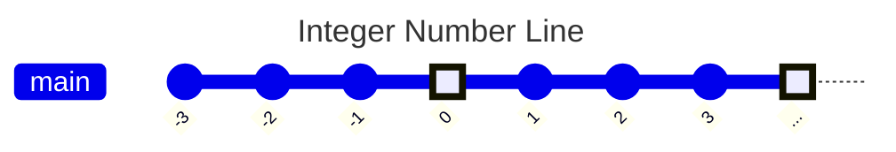
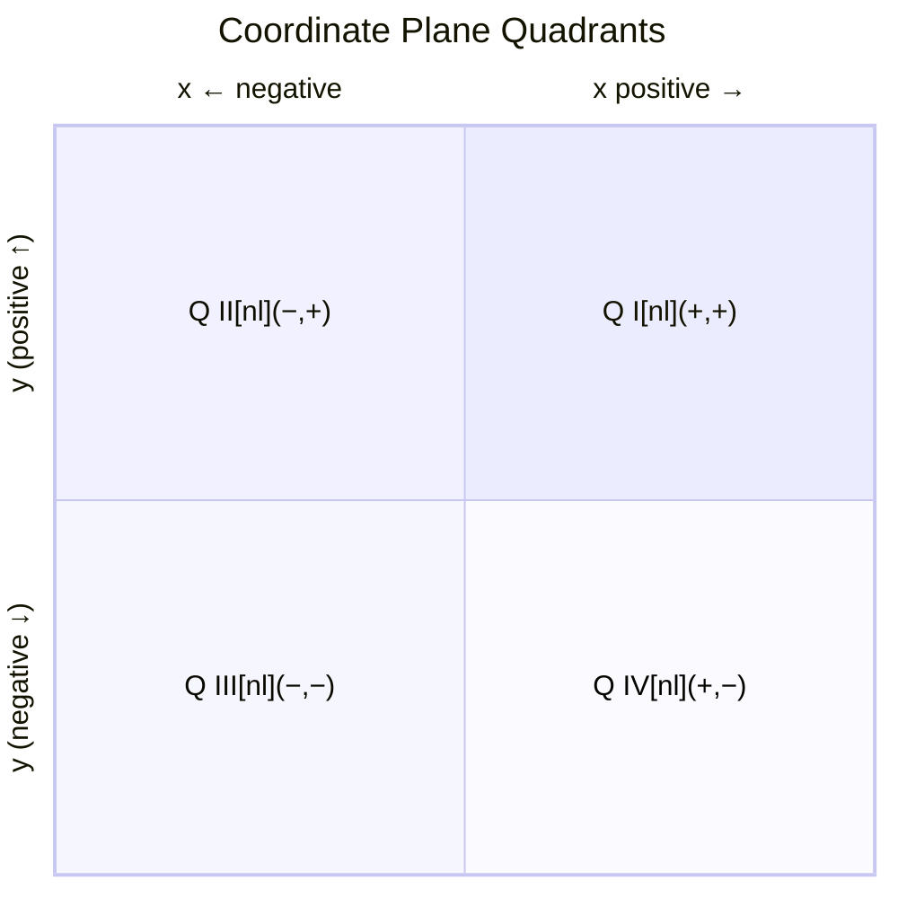
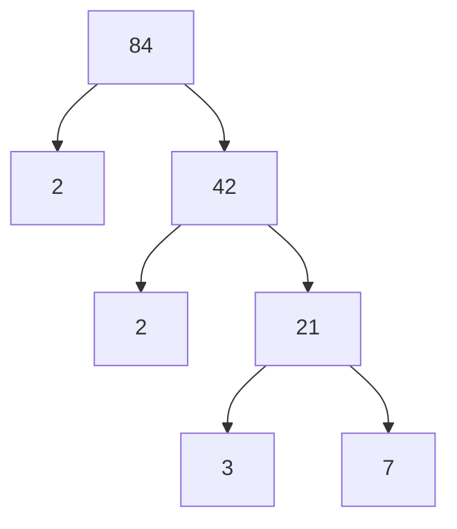
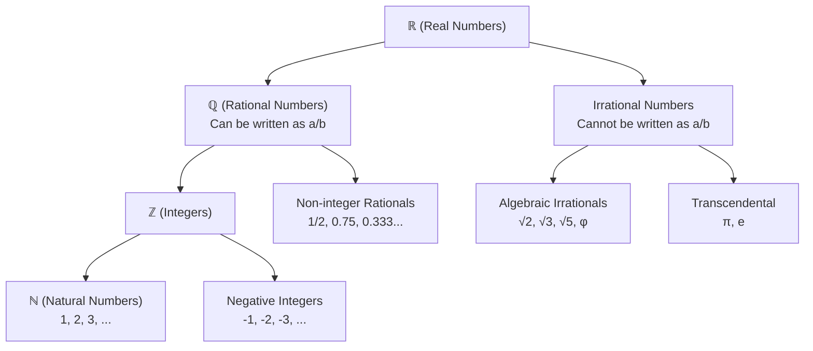
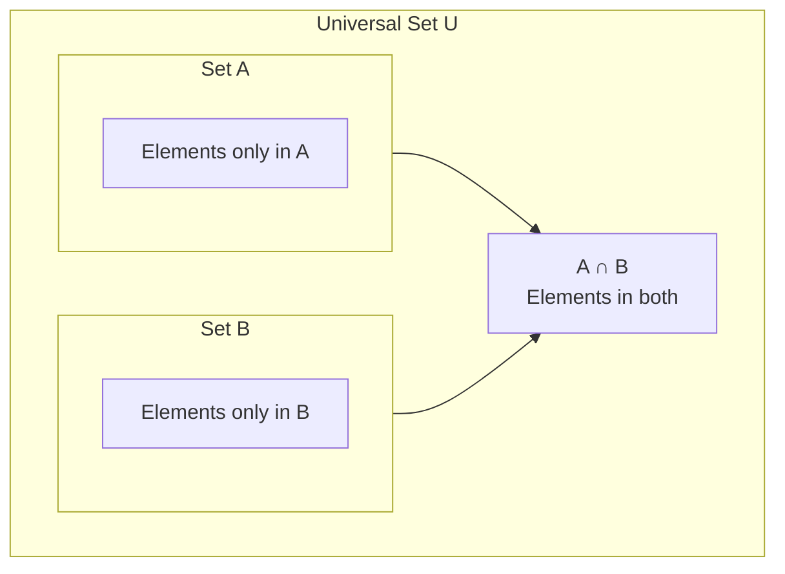
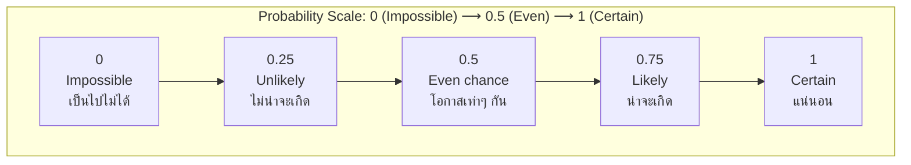
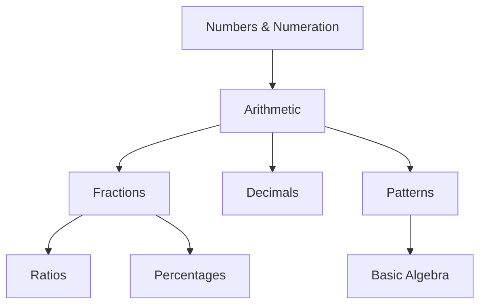

# Mermaid Patterns for Obsidian Math Notes

> **Last updated:** 2026-07-22 | **Mermaid version:** v11.16.0+
> **Verified against:** mermaid.js.org official docs (raw markdown from mermaid-js/mermaid repo)

Tested, working Mermaid diagram patterns for replacing common ASCII diagrams in Obsidian math notes. Each pattern has been verified against the latest Mermaid documentation (v11.16.0).

## Pattern Selection Guide

| What to Show | Mermaid Type | Why |
|---|---|---|
| Number lines | `gitGraph` | Linear commit history maps to number line with highlights for zero/ellipsis |
| Coordinate quadrants | `quadrantChart` | Purpose-built for 4-quadrant layouts |
| Factor trees | `flowchart TD` | Top-down tree branching |
| Number hierarchies | `flowchart TD` | Tree structure with subgraphs |
| Venn diagrams | `flowchart TD` | Nested subgraphs with overlap arrows |
| Probability scales | `flowchart LR` | Chained nodes represent 0→1 progression |
| Process flows | `flowchart LR` | Left-to-right sequential steps |

---

## Pattern 1 — Number Line (gitGraph)

**Key points:**
- `"..."` at both ends → shows infinite extension
- `type: HIGHLIGHT` on zero and ellipsis marks → visual anchors
- `---` frontmatter block for title (valid in Mermaid v11+)
- `gitGraph` with capital G required

---

## Pattern 2 — Coordinate Plane Quadrants (quadrantChart)

**Key points:**
- `quadrant-1` through `quadrant-4` with HYPHENS (NOT spaces: `quadrant I` fails)
- `[nl]` inserts newline in quadrant labels
- `y-axis "bottom-label" --> "top-label"` — bottom-to-top flow (positive at top)
- `x-axis "left-label" --> "right-label"` — left-to-right flow
- Standard Cartesian ordering: QI (+,+), QII (−,+), QIII (−,−), QIV (+,−)

---

## Pattern 3 — Factor Tree (flowchart TD)

**Key points:**
- `flowchart TD` = top-down (same as `TB`)
- Square bracket labels `["text"]` for rectangular nodes
- `-->` for arrow edges
- Reusing node ID without re-specifying label is valid

---

## Pattern 4 — Number Hierarchy Tree (flowchart TD)

**Key points:**
- Use `\n` for multi-line node labels
- Keep nodes at the same hierarchy level on the same indentation
- Define all nodes first, then all edges (cleaner rendering)

---

## Pattern 5 — Venn Diagram (flowchart TD with subgraphs)

**Key points:**
- Nested `subgraph` blocks for containment
- Arrows from parent sets to overlap node show intersection
- Label overlap node with `∩` symbol and newline for description

---

## Pattern 6 — Probability Scale (flowchart LR)

**Key points:**
- `direction LR` inside subgraph forces left-to-right
- Use `\n` for multi-line labels (value + English + Thai)
- Title in subgraph label shows the full scale interpretation

---

## Pattern 7 — Topic Dependency Graph (flowchart TD)

For showing prerequisite chains between concept areas:

**Key points:**
- Common for BOK overview files
- Each node = one concept area
- Arrows show prerequisite → next-topic chains

---

## Verification Notes

**2026-07-22:** All patterns verified against Mermaid v11.16.0 official docs. Key findings:
- `quadrantChart` uses `quadrant-1` (hyphen) not `quadrant I` (space)
- `quadrantChart` y-axis flows bottom→top: `"negative ↓" --> "positive ↑"`
- `gitGraph` syntax with `---` frontmatter is valid
- `flowchart TD`/`LR` are standard and stable
- `graph` keyword is legacy — prefer `flowchart`

**Common Pitfalls:**
- ❌ `quadrant I` → ✅ `quadrant-1`
- ❌ `y-axis "positive ↑" --> "negative ↓"` → ✅ `y-axis "negative ↓" --> "positive ↑"` (bottom→top)
- ❌ `graph TD` → ✅ `flowchart TD`
- ❌ No title block in gitGraph → ✅ `---\ntitle: My Title\n---` before gitGraph

## When to Use ASCII Instead

Mermaid is preferred, but ASCII code blocks are better for:
- **Column arithmetic:** aligned addition/subtraction layouts (decimal point alignment)
- **Short simple diagrams** where Mermaid overhead is excessive
- Alignments that depend on monospace spacing (not graph structure)
