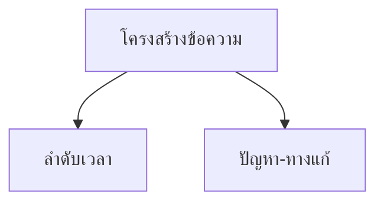

# Thai Language Topic Note Pattern

> Proven format for fully-Thai educational notes in the ภาษาไทย vault (not bilingual like Science).

## When to Use

When creating individual topic notes for the Thai language subject (ภาษาไทย). These notes are written ENTIRELY in Thai — headings, explanations, tables, examples, wikilinks — because the subject IS the Thai language itself. This differs from Science notes which use English narrative with Thai in `(...)` parens.

## Folder Structure

```
general-knowledge/ภาษาไทย/
├── 00_ภาพรวม.md                    ← Master overview (all 5 strands)
├── การอ่าน/                         ← Strand 1: Reading
│   ├── 00_ภาพรวมการอ่าน.md         ← Strand overview + mermaid diagram
│   ├── 01_การอ่านออกเสียงขั้นพื้นฐาน.md
│   ├── 02_การอ่านออกเสียงคำและประโยค.md
│   └── ... (up to 15_นิสัยรักการอ่าน.md)
├── การเขียน/                        ← Strand 2: Writing
├── การฟัง การดู และการพูด/          ← Strand 3: Listening/Viewing/Speaking
├── หลักการใช้ภาษาไทย/               ← Strand 4: Language Principles
└── วรรณคดีและวรรณกรรม/              ← Strand 5: Literature (HIERARCHICAL — see below)
```

## Two Format Variants

### Format A: Flat Strand (Strands 1-4)

Standard flat folder with `01_ชื่อเรื่อง.md` numbered files. Used for การอ่าน, การเขียน, การฟัง การดู และการพูด, หลักการใช้ภาษาไทย.

### Format B: Hierarchical Era-Based (Strand 5 — วรรณคดีและวรรณกรรม)

Adapted from the `oralita_md/musical/` format. Uses **era folders** instead of flat numbered files, with each era containing an overview + individual work notes. This produces a richer, more navigable structure for literature.

```
วรรณคดีและวรรณกรรม/
├── 00_ภาพรวม.md                              ← Master overview
├── สมัยสุโขทัย/                                ← Era folder
│   ├── 00_overview.md                         ← Era overview (like musical/00_overview.md)
│   ├── 01_ศิลาจารึกพ่อขุนรามคำแหง.md          ← Individual work note (like song note)
│   ├── 02_ไตรภูมิพระร่วง.md
│   └── 03_สุภาษิตพระร่วง.md
├── สมัยอยุธยา/
│   ├── 00_overview.md
│   ├── 01_โองการแช่งน้ำ.md
│   ├── 02_ลิลิตยวนพ่าย.md
│   ├── 03_สมุทรโฆษคำฉันท์.md
│   └── 04_กาพย์เห่เรือ.md
├── สมัยรัตนโกสินทร์/
│   ├── 00_overview.md
│   ├── 01_รามเกียรติ์.md
│   ├── 02_อิเหนา.md
│   ├── 03_ขุนช้างขุนแผน.md
│   ├── 04_มัทนะพาธา.md
│   └── สุนทรภู่/                               ← Author sub-folder (like artist folder)
│       ├── 00_overview.md
│       ├── 01_พระอภัยมณี.md
│       ├── 02_นิราศเมืองแกลง.md
│       └── 03_นิราศภูเขาทอง.md
├── วรรณกรรมสมัยใหม่/
│   ├── 00_overview.md
│   ├── 01_สี่แผ่นดิน.md
│   ├── 02_คำพิพากษา.md
│   └── 03_วรรณกรรมร่วมสมัย.md
├── นิทานและตำนาน/
│   └── 00_overview.md
└── การวิเคราะห์วรรณคดี/
    ├── 00_overview.md
    ├── 01_การวิเคราะห์องค์ประกอบ.md
    └── 02_วรรณคดีวิจักษณ์.md
```

#### Musical-to-Literature Format Mapping

| Musical Format Element | Literature Adaptation |
|---|---|
| `00_overview.md` with About table, story summary, song list | `00_overview.md` with About table (era, kings, characteristics), works list |
| Song note: Lyrics + Thai translation | Work note: Classical passage + modern Thai explanation |
| Detail table (line-by-line lyric analysis) | Detail table (line-by-line passage analysis: original → modern → note) |
| Grammar Points section | วรรณศิลป์ section (literary devices, โวหาร, ฉันทลักษณ์) |
| Vocabulary Highlights | คำศัพท์โบราณ (old Thai vocabulary table) |
| Key Takeaways | คติธรรมและคุณค่า (moral lessons + literary/social/historical value) |

#### Individual Work Note Template (Format B)

```yaml
---
title: "ชื่อวรรณคดี"
source: "วรรณคดีสมัย..."
author: "ผู้แต่ง"
era: "สุโขทัย/อยุธยา/รัตนโกสินทร์"
strand: "สาระที่ 5: วรรณคดีและวรรณกรรม"
tags: [thai-language, literature, <era-tag>, <work-tag>]
---
```

Body sections:
1. `## เกี่ยวกับผลงาน` — About table (name, author, era, type, significance)
2. `## เนื้อหาสาระ` — Content summary with mermaid flowchart
3. `## บทอักษรสำคัญ + คำแปลปัจจุบัน` — Key passages in original + modern Thai
4. `### ตารางวิเคราะห์บทอักษร` — Line-by-line detail table (#, original, modern, note)
5. `## วรรณศิลป์` — Literary devices used
6. `## คติธรรมและคุณค่า` — Moral lessons and literary/social/historical value
7. `## คำศัพท์เฉพาะ` — Old Thai vocabulary table (old → modern → note)
8. `## ความรู้ที่เชื่อมโยง` — Cross-links to other strands
9. `## สรุปสำคัญ` — Key takeaways
10. `## ดูเพิ่มเติม` — Navigation links

## YAML Frontmatter (English keys, Thai values)

```yaml
---
tags: [thai-language, reading, <specific-tag>, <grade-level>]
source: "หลักสูตรแกนกลางการศึกษาขั้นพื้นฐาน พ.ศ. 2551"
strand: "สาระที่ 1: การอ่าน"
---
```

## Note Body Structure (6 sections — Format A)

### 1. Title + Quote Block
```markdown
# ชื่อหัวข้อ

> ประโยคสรุปใจความสำคัญสั้นๆ หนึ่งบรรทัด

**คำนิยาม** คือ คำอธิบายเบื้องต้นของหัวข้อนี้...
```

### 2. เนื้อหาตามช่วงชั้น (Grade Band Table)
```markdown
## เนื้อหาตามช่วงชั้น

| ช่วงชั้น | เนื้อหา |
|---|---|
| **ป.1–3** | เนื้อหาระดับต้น |
| **ป.4–6** | เนื้อหาระดับกลาง |
| **ม.1–3** | เนื้อหาระดับมัธยมต้น |
| **ม.4–6** | เนื้อหาระดับมัธยมปลาย |
```

### 3. Comparison / Terminology Tables
Multiple tables comparing concepts, giving examples, or listing terminology. Use Thai throughout.

### 4. Mermaid Diagrams
Use `flowchart TD` (never `graph`). Follow standard mermaid rules:
- No `()` in labels → use `&#40;`/`&#41;`
- No `"1."` dot-numbers → use `"1 "`
- No `&` → use `และ` (Thai word for "and")



### 5. Tips / Practical Techniques
```markdown
## เคล็ดลับ

1. ข้อแนะนำที่ 1
2. ข้อแนะนำที่ 2
```

### 6. Cross-links
```markdown
## ดูเพิ่มเติม

- [[02_ชื่อไฟล์|ชื่อหัวข้อ]]
- [[03_ชื่อไฟล์|ชื่อหัวข้อ]]
```

Use `## ดูเพิ่มเติม` (not `## Cross-Links` or `## Related`).

## Strand Overview File (00_ภาพรวม*.md)

Each strand folder gets its own overview with:
1. YAML frontmatter with `strand:` tag
2. Brief overview paragraph
3. Mermaid flowchart showing strand structure and topic distribution by grade band
4. Complete topic list table with `[[wikilinks]]`
5. Cross-strand connections table

## Creation Workflow

### Batch Creation via execute_code
Use Python with `from hermes_tools import write_file` to create 3 notes per batch. This is the proven sweet spot for context management:

```python
from hermes_tools import write_file

base = "F:/obsidian_note/general-knowledge/ภาษาไทย/การอ่าน"

write_file(f"{base}/07_การอ่านวิเคราะห์.md", """---
tags: [...]
...
""")
print("07 done")

write_file(f"{base}/08_การอ่านตีความ.md", """...""")
print("08 done")

write_file(f"{base}/09_การอ่านเชิงวิพากษ์.md", """...""")
print("09 done")
```

### Strand-by-Strand Approach
For large subjects (~96 notes across 5 strands), create one strand at a time:
1. Start with `00_ภาพรวม.md` (master overview)
2. Create strand folder + `00_ภาพรวม<strand>.md`
3. Create all topic notes for that strand in batches of 3
4. Verify with `find` via terminal
5. Move to next strand

This prevents context window exhaustion and ensures no gaps between strands.

### Content Filter False Positives
Educational Thai language content may trigger content filter false positives (flagged as "inappropriate" or "containing secrets"). This is harmless — the content is standard curriculum material for Thai students.

**Workaround:** The user will say "anyway continue" — just proceed with the next batch. Do NOT halt generation or ask for confirmation. Do NOT retry the flagged content. Just continue creating the remaining notes.

### Post-Creation Cleanup Pass (Critical for Large Strands)
After batch-creating 15+ files in one strand, run a corruption cleanup:

1. **Scan first:** `grep -rn '[ไ-ฮ][A-Za-z]' *.md` to find all Latin-in-Thai artifacts
2. **Build fixes list** from the grep output
3. **Batch sed:** Run via `execute_code` with a Python loop calling `terminal`:
   ```python
   for old, new in fixes:
       cmd = f'find "{base}" -name "*.md" -exec sed -i \'s/{old}/{new}/g\' {{}} \\;'
       terminal(cmd)
   ```
4. **Verify:** Re-run grep to confirm all patterns fixed

This is more efficient than individual `patch` calls when a strand has 15+ files.

## Key Formatting Rules

1. **YAML keys in English**, values in Thai (e.g., `strand: "สาระที่ 1: การอ่าน"`)
2. **Section headings in Thai** (e.g., `## เนื้อหาตามช่วงชั้น`, `## ดูเพิ่มเติม`)
3. **Mermaid node labels in Thai** with proper escaping
4. **Tables use Thai** for all content
5. **Wikilinks use Thai filenames** (e.g., `[[01_การอ่านออกเสียงขั้นพื้นฐาน|การอ่านออกเสียงขั้นพื้นฐาน]]`)
6. **No English in body text** unless it's a technical term (e.g., "Critical Reading", "Fake News", "Speed Reading")
7. **Numbered prefixes** follow `01_` pattern, each strand restarts from 01
8. **Format A (flat) for grammar/skill strands**, **Format B (hierarchical era-based) for literature** — see above

## Completed Strands

| Strand | Status | Files | Format | Notes |
|---|---|---|---|---|
| การอ่าน (Reading) | ✅ Complete | 17 (1 overview + 16 topics) | A (flat) | Created 2026-08-02 |
| การเขียน (Writing) | ✅ Complete | 16 (1 overview + 15 topics) | A (flat) | Created 2026-08-02 |
| การฟัง การดู และการพูด (Listening) | ✅ Complete | 11 (1 overview + 10 topics) | A (flat) | Created 2026-08-02 |
| หลักการใช้ภาษาไทย (Grammar) | ✅ Complete | 24 (1 overview + 23 topics) | A (flat) | Created 2026-08-02 — batch sed cleanup |
| วรรณคดีและวรรณกรรม (Literature) | ✅ Complete | 27 (1 master + 6 era overviews + 20 work notes) | B (hierarchical) | Created 2026-08-02 — musical-style format |

**Total: 96 files across all 5 strands + master overview.**
