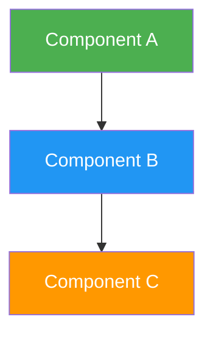
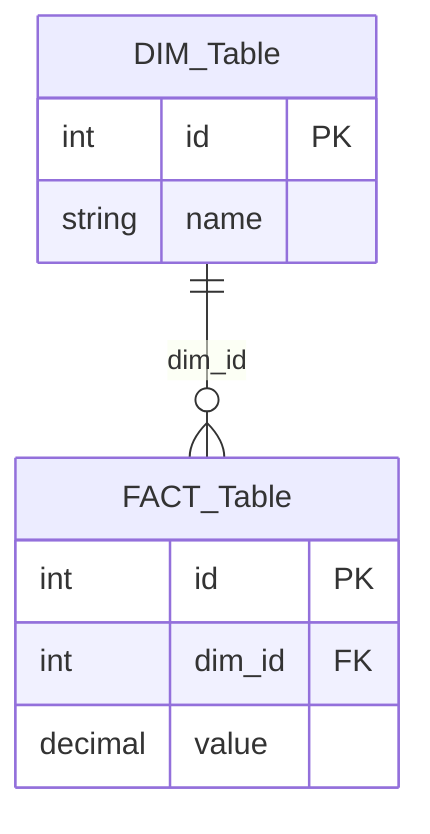
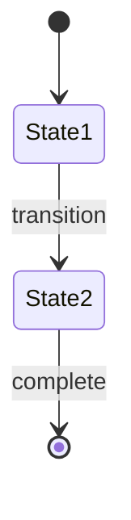
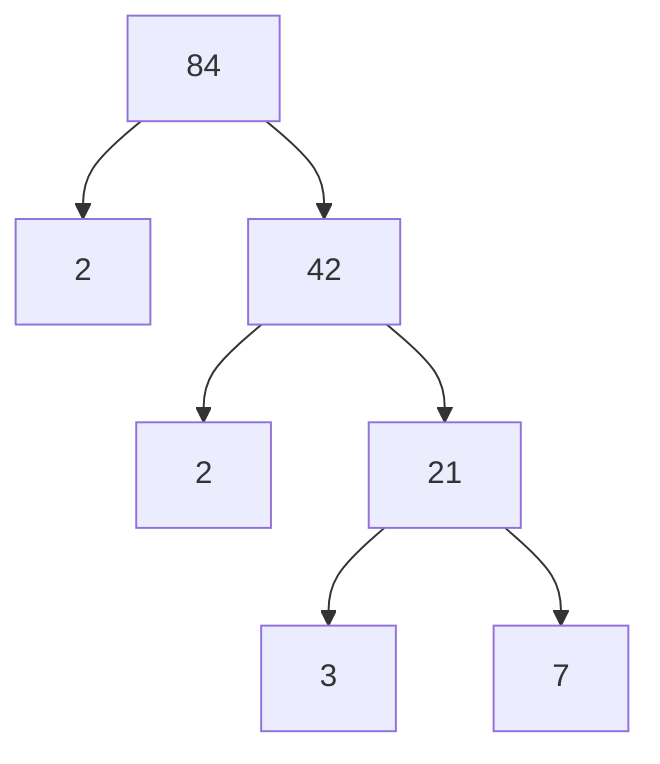
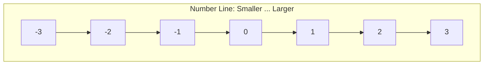
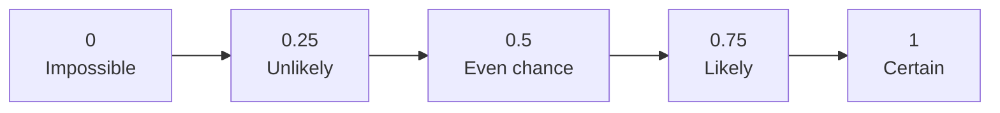
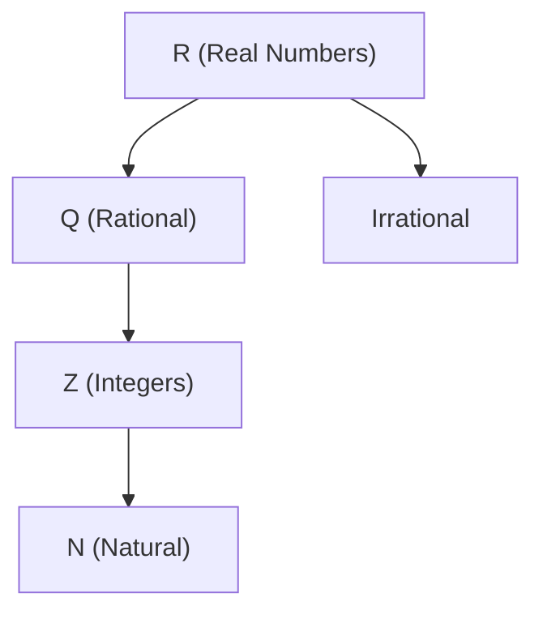
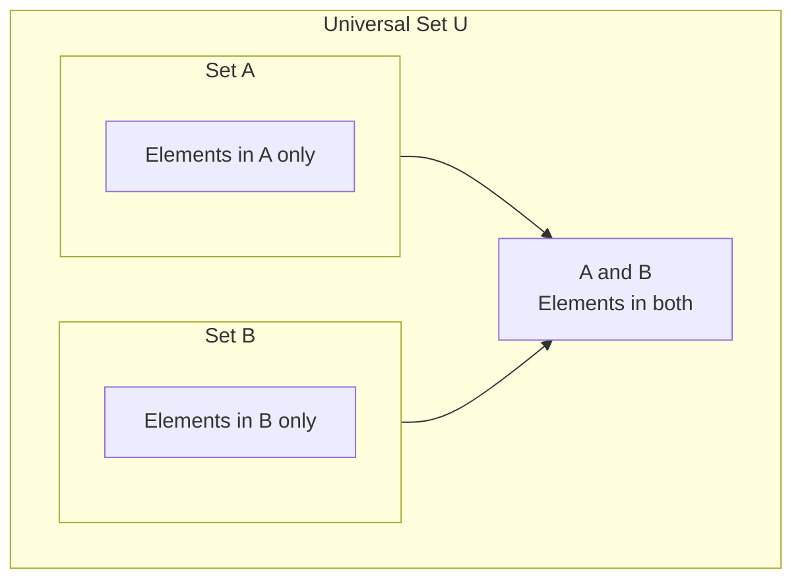

# Mermaid Conversion Pattern

## When to Use

When the user asks to convert ASCII diagrams to Mermaid, or when creating new Obsidian notes that contain diagrams.

## Mermaid Type Selection

| Diagram Type | Mermaid Type | Use Case | Example |
|--------------|--------------|----------|---------|
| Process flow | `flowchart TD` or `flowchart LR` | Pipelines, workflows, architectures | Compiler pipeline, ETL/ELT |
| Entity-Relationship | `erDiagram` | Database schemas | Star schema, Snowflake schema |
| State transitions | `stateDiagram-v2` | State machines, workflows | Model registry stages, circuit breaker |
| Architecture | `flowchart` with `subgraph` | System components with grouping | Microservices, EDW with data marts |
| Sequence | `sequenceDiagram` | Message flows between components | API calls, distributed transactions |
| Class | `classDiagram` | OOP class relationships | Design patterns |

## Conversion Patterns

### ASCII Box-and-Arrow to flowchart



### ASCII ER Diagram to erDiagram



### ASCII State Machine to stateDiagram-v2



## Style Conventions

- Use colors to distinguish component types (green for input, blue for processing, orange for output, purple for monitoring)
- Use `subgraph` to group related components
- Use `-->|label|` for labeled arrows
- Use `-.->` for async/dashed connections
- Use `[(...)]` for database cylinders
- Use `[...]` for process boxes

## Pitfalls

- **Don't convert tables to Mermaid.** Comparison tables (OLTP vs OLAP, FDMA vs TDMA) are better as markdown tables.
- **Don't convert math formulas to Mermaid.** Shannon-Hartley, Friis equation stay as LaTeX.
- **Don't over-engineer simple flows.** A 3-step pipeline doesn't need subgraphs or colors.
- **Always add styles.** Plain Mermaid diagrams are visually bland. Add `style` directives for color.
- **Don't use `xychart-beta` for Pareto/frontier visualizations.** The `xychart-beta` type doesn't support multiple series with different x-values (line and scatter must share the same x-axis points). Use `quadrantChart` instead for cost-vs-quality, Pareto frontier, or multi-objective trade-off visualizations. `quadrantChart` supports named data points with independent x,y coordinates and labeled quadrants.

## Math Education Patterns

The following Mermaid patterns were developed for Thai IPST fundamental mathematics (ป.1-ม.3) topic notes and apply to any math education content.

### Factor Tree (flowchart TD)


### Number Line (flowchart LR with subgraph)


### Coordinate Quadrants (quadrantChart)
```mermaid
quadrantChart
    title Coordinate Plane Quadrants
    x-axis "x (negative)" --> "x (positive)"
    y-axis "y (positive)" --> "y (negative)"
    quadrant I "Q I: (+,+)"
    quadrant II "Q II: (-,+)"
    quadrant III "Q III: (-,-)"
    quadrant IV "Q IV: (+,-)"
```

### Probability Scale (flowchart LR)


### Real Number System Tree (flowchart TD)


### Venn Diagram (flowchart TD with subgraphs)


### LaTeX/MathJax Safety Rules for Math Notes

When writing Obsidian notes with MathJax formulas via `write_file`:

- **Use SINGLE backslashes** for LaTeX commands: `\frac`, `\times`, `\div`, `\text`, `\boxed`, `\sqrt`, `\begin`, `\end`
- **NEVER use double backslashes** (`\\frac`) — they produce broken rendering
- **Prefer plain-text alternatives** to complex LaTeX:
  - Tables for value displays instead of `\begin{array}`
  - `>` blockquotes for simple formulas instead of `$$...$$`
  - Code blocks for arithmetic notation instead of `\begin{aligned}`
- **Post-write verification:**
  ```bash
  grep -c '\\\\\\\\' *.md          # Find broken LaTeX
  grep -l -E '\-\-\-|\+--|\|  \|' *.md  # Find ASCII diagrams
  sed -i 's/\\\\frac/\\/g; s/\\\\times/\\/g; s/\\\\div/\\/g' *.md  # Fix
  ```
