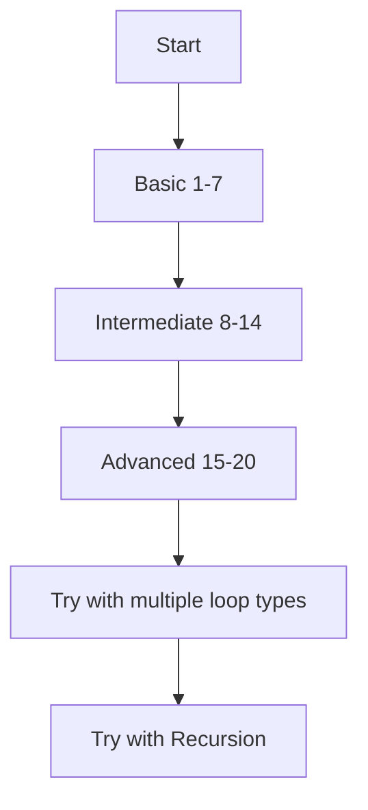

# Programming Concept Lesson Structure

Pattern for teaching programming concepts (loops, conditionals, data structures) to beginners in a bilingual Thai-English context. Used when filling in or expanding a partial lesson the user has started.

## When to Use

- User has a partial lesson note and asks to fill gaps, add sections, or expand
- User is teaching programming concepts to beginners (students, internet strangers, juniors)
- Topic is a fundamental programming concept: loops, conditionals, recursion, data types

## Structure Template

### 1. Concept Overview Table

Start with a comparison table of all variants/types before diving into each one:

```markdown
| Type | Key Trait | When to Use |
|------|-----------|-------------|
| Variant A | ... | ... |
| Variant B | ... | ... |
| Variant C | ... | ... |
```

### 2. Per-Variant Section

Each variant/type gets its own section with:

```markdown
# [Variant Name]

[One-line Thai explanation of when to use it]

[Pseudocode block — Pascal-like syntax]
```pascal
FOR start ; condition ; step
    // coding
ENDFOR
```

[Python equivalent]
```python
for var in range(n):
    # coding
```

[Worked example — map to the 3-component framework if applicable]
- Component 1 → how it maps
- Component 2 → how it maps
- Component 3 → how it maps

[Full code example in pseudocode + Python]
```

### 3. Pseudocode Convention

Use Pascal-like pseudocode for readability:
- Keywords: `FOR`, `WHILE`, `REPEAT...UNTIL`, `IF...THEN...ENDIF`, `LET`, `SHOW`, `READ`, `FUNCTION`, `RETURN`
- Semicolons separate statements
- Block endings: `ENDFOR`, `ENDWHILE`, `ENDFUNCTION`
- This is more readable for beginners than C-like syntax

### 4. Difficulty-Graded Exercises

Organize exercises into 3 tiers with explicit I/O examples:

```markdown
## ระดับเริ่มต้น (Basic)
**1. Problem name**
- input: X → output: Y

## ระดับกลาง (Intermediate)
**N. Problem name with formula**
- input: X → output: Y

## ระดับท้าทาย (Advanced)
**M. Problem name**
- Description of what to compute
- input: X → output: Y
```

- 7-8 Basic, 5-7 Intermediate, 5-6 Advanced ≈ 20 total
- Every problem MUST have a concrete input → output example
- Use LaTeX `$$...$$` for math formulas in problem descriptions

### 5. Include Related Concepts

When teaching loops, include recursion even though it's not technically a loop. Frame it as:
- "ไม่ใช่ loop แต่เป็นอีกวิธีในการทำ iteration"
- Show base case + recursive case structure
- Same pseudocode + Python dual format
- Note practical limits (stack overflow, recursion limit)

### 6. Summary Comparison Table

End with a full comparison table adding all variants + related concepts:

```markdown
| Type | When to Use | Condition Check | Strength |
|------|-------------|-----------------|----------|
```

### 7. Learning Progression (Optional)

Add a Mermaid flowchart for recommended practice order:



## Style Notes

- **Thai for explanations**, English for code and technical terms
- User polishes the output into their own voice — produce clean, complete content, not a finished product
- Use `patch` for targeted edits, `execute_code` for batch additions
- The "3-component framework" (start, continue, end) works well for loops; adapt for other concepts (e.g., conditionals: condition, true-path, false-path)
- Mermaid diagrams preferred over ASCII for any visual

## Pitfalls

- Don't copy code examples between sections — each variant needs its OWN example, not a copy-paste of the first one
- When adding exercises, verify math is correct (e.g., sum 1-100 = 5050, not 5500)
- SearXNG rate-limits after ~3 rapid calls — space out searches or batch into one multi-query execute_code call
- User writes in casual Thai with intentional informality — match the register when filling gaps, don't make it overly formal
