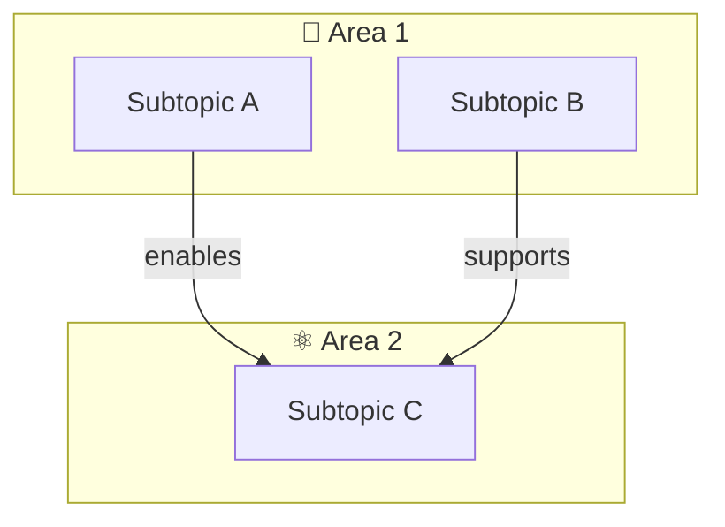

# Template: Body of Knowledge — Top-Level Overview

Use this template when creating a `Body of Knowledge - Overview.md` for a new domain.

```yaml
---
tags: [overview, body-of-knowledge, DOMAIN-TAG-1, DOMAIN-TAG-2]
---
```

```markdown
# Body of Knowledge — Overview (Domain Name)

> **Purpose:** A curated collection of N core knowledge areas for [target audience] — Area 1, Area 2, Area 3, ...
>
> **Source:** Organizing body and standard (e.g., IPST/สสวท., IEEE, ISO) — include official resource links
> **Total Topics:** ~N across X subject areas

## The N Knowledge Areas

| Area | Thai Name | Course Codes | Topics | Focus |
|---|---|---|---|---|
| 🔢 **Area 1** | Thai name if applicable | Code range | ~20 | One-line description |
| ⚛️ **Area 2** | Thai name | Code range | ~18 | One-line description |
| ... | ... | ... | ... | ... |

## Area 1 — Name

[[Area 1 - Overview|→ Full Overview]]

[2-3 sentence description of what this area covers]

| Category | Topics |
|---|---|
| **Sub-category 1** | Topic A, Topic B, Topic C |
| **Sub-category 2** | Topic D, Topic E |

**Vault:** `Area 1\` — ~N topic files

[Repeat for each area]

## How These Areas Relate

[Mermaid flowchart showing inter-area dependencies]



- **Area 1** provides [what it provides]
- **Area 2** explains [what it explains]

## Reading Paths

- **Track A:** Area 1 → Area 2 → Area 3
- **Track B:** Area 2 → Area 1 → Area 4

## Related

- [[Other BOK Overview|Other BOK]] — if the vault has multiple BOKs
```

## Conventions

- **Emoji per area** — Choose a distinctive emoji for each area (🔢 Mathematics, ⚛️ Physics, 🧪 Chemistry, etc.)
- **Topic counts are approximate** — Use ~N format (e.g., ~20)
- **Mermaid diagram is required** — Shows how areas connect; most valuable part
- **Reading paths** — At least 2-3 different tracks based on common goals
- **Cross-links** — If the vault has other BOKs, link to them in Related
