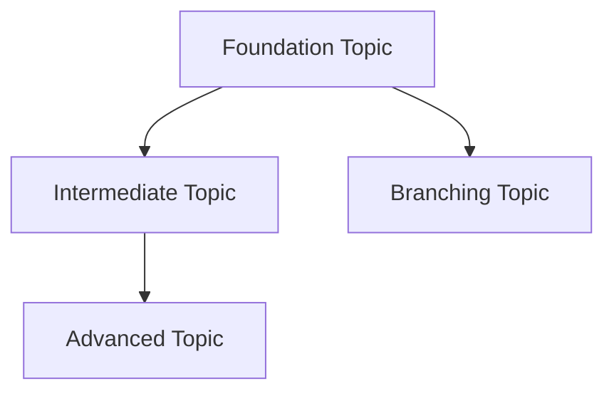

# Template: BOK Subject/Discipline Overview

Use this template for individual subject overview files within a Body of Knowledge (e.g., `Mathematics/Mathematics - Overview.md`).

```yaml
---
tags: [overview, SUBJECT-TAG, DOMAIN-TAG, level-tag]
---
```

```markdown
# Subject Name — Thai Name (if applicable)

> **Subject Area:** Full name for [target audience] (level, years)
> **Course Codes:** Official curriculum codes (e.g., ค301-303, ว301-303) — include if the domain has standardized codes
> **Total Topics:** ~N | **Duration:** X years (Y semesters)
> **Source:** Organizing body and standard (e.g., IPST/สสวท., IEEE, ISO) — link to official resources if available
> **Foundation for:** What this enables downstream

## What Is This?

[2-3 paragraphs explaining the subject, its importance, and how it fits into the curriculum/profession. Include context about the organizing body if relevant (e.g., สสวท. for Thai curriculum, IEEE for engineering).]

## The ~N Topic Areas

### 🔧 Category 1 (e.g., Year 1 / Foundation)
- [[01_Topic_Name]] — Key concepts, subtopics, why it matters
- [[02_Topic_Name]] — Key concepts, subtopics, why it matters
- ...

### 📈 Category 2 (e.g., Year 2 / Intermediate)
- [[05_Topic_Name]] — Key concepts
- ...

### 🧮 Category 3 (e.g., Year 3 / Advanced)
- [[10_Topic_Name]] — Key concepts
- ...

## Topic Distribution

| Year/Level | Semester/Phase 1 | Semester/Phase 2 |
|---|---|---|
| **Year 1** | Topics 1-3 | Topics 4-6 |
| **Year 2** | Topics 7-9 | Topics 10-12 |
| **Year 3** | Topics 13-15 | Topics 16-18 |

## Prerequisites

- **Before Year 1:** What students need to know entering
- **Before Year 2:** What from Year 1 is required
- **Before Year 3:** What from Year 2 is required

## How Topics Connect

[Mermaid flowchart showing topic dependencies WITHIN this subject]



## Key Connections to Other Subjects

- [[Other Subject - Overview|Other Subject]] — How it connects (specific topics)
- [[Another Subject - Overview|Another Subject]] — How it connects

## Reading Paths

- **Track A (e.g., Engineering prep):** 01 → 02 → 03 → 05 → 06
- **Track B (e.g., Medicine prep):** 01 → 04 → 07 → 08
- **Full sequence (recommended):** 01 through N in order

## Related

- [[Body of Knowledge - Overview|← Back to BOK Overview]]
- [[Related Subject - Overview|Related Subject]]
```

## Conventions

- **One topic per wikilink** — Each `[[topic]]` maps to a future file
- **Topics are numbered** — `01_`, `02_`, etc. for ordering
- **Mermaid diagram is required** — Shows internal topic dependencies
- **Prerequisites section** — Critical for scaffolding; don't skip
- **Reading paths** — Different goals need different orderings
- **Cross-links to other subjects** — Shows how this subject connects to the broader BOK
- **Topic distribution table** — Shows how topics spread across years/semesters
