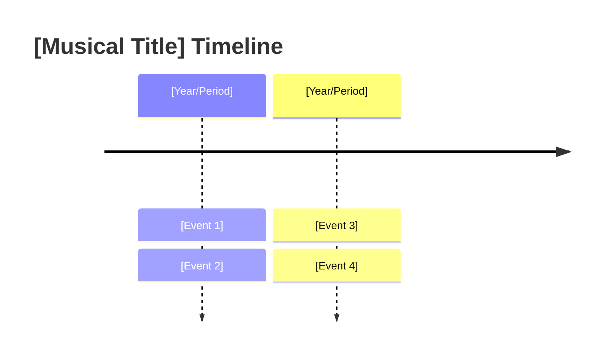

---
tags:
  - overview
  - musical
  - [musical-name-tag]
---

# [Musical Title] — Overview
> Song reference guide for English learning notes

---

## About the Musical

| Detail | Info |
|--------|------|
| **Based on** | [source material] |
| **Music by** | [composer] |
| **Lyrics by** | [lyricist] |
| **Premiere** | [year, location] |
| **Format** | [stage musical / animated film / concept album / live-action film] |
| **Status** | [running / completed / film release] |
| **Awards** | [notable awards, if any] |

> **Note:** [Optional callout for edge cases, e.g., "Is it a musical? Yes, because songs advance the story. Not a traditional Broadway musical, but classified as a modern musical film."]

---

## Story Summary

[2-3 paragraphs covering the full plot arc. Group by Act if applicable.]

---

## Complete Song List

### Act I
| # | Song | Character(s) |
|---|------|-------------|
| 1 | Song Title | Character |
| 2 | Song Title | Character |

### Act II
| # | Song | Character(s) |
|---|------|-------------|
| N | Song Title | Character |

---

## English Learning Themes

| Theme | Example |
|-------|---------|
| [Grammar/vocab theme] | [Example from the musical] |
| [Idiom/collocation theme] | [Example from the musical] |
| [Register/style theme] | [Example from the musical] |

> This section identifies what English learning value the musical offers as a whole. It is NOT per-song analysis (that goes in the song lesson notes). Focus on: grammar patterns, idioms, register variety, figurative language density, vocabulary domains.

---

## Songs Studied in This Vault

| Song | Character | Context in Story | Lesson File |
|------|-----------|-----------------|------------|
| **Song Title** | Character | When this song occurs in the story | [[##_Song_Title]] |

> Mark studied songs with ⭐ in the complete song list above AND list them here. Use the numbered short-format wikilink (e.g., `[[05_I_Dreamed_a_Dream]]`) matching the actual song file name in the same folder.

---

## Sources

- [Composer]. ([Year]). *[Musical Title]* [Musical/Film]. [Studio/Producer].
- [Source material author]. *[Source title]* ([Year]).
- Wikipedia contributors. "[Article title]." *Wikipedia*. Retrieved [Date], from [URL]
