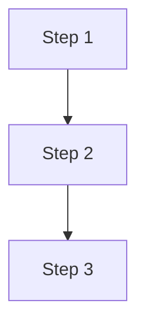
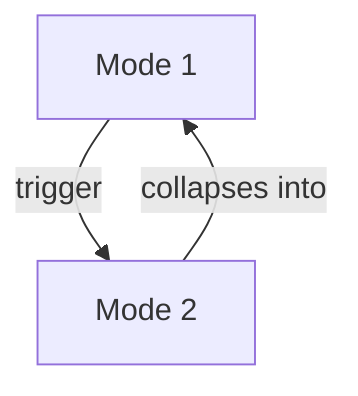
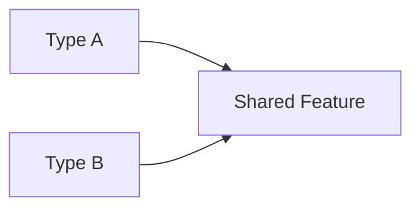
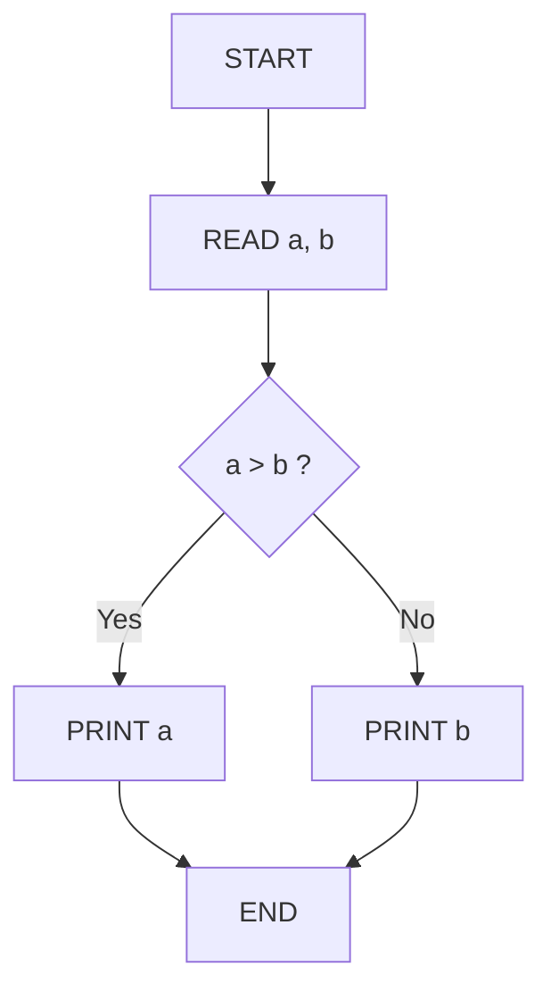
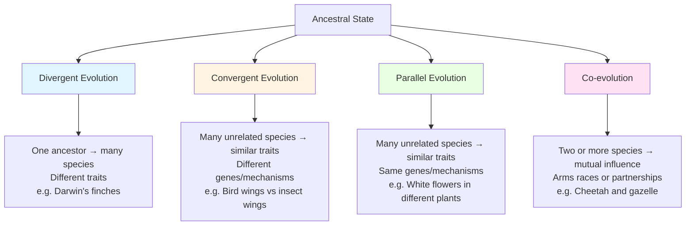

# Obsidian Note Authoring

Synthesize source material into structured, high-quality Obsidian notes. This skill covers the **authoring workflow** — reading source material, planning structure, writing with frontmatter/sections/diagrams/wikilinks, and validating completeness. For basic Obsidian CRUD operations (read, list, search, append), use the `obsidian` skill instead.

## When to use this skill

- User asks to summarize a book chapter, article, transcript, or document into an Obsidian note
- User provides specific formatting requirements (frontmatter tags, section hierarchy, wikilinks to related notes)
- User wants structured notes with diagrams, checklists, or cross-references
- Task involves creating knowledge base entries from domain material

## Workflow

### Step 1: Read the full source material

- Read the ENTIRE source before writing anything — do not start writing after reading only the first portion
- For large sources (>1000 lines), read in parallel chunks (offset/limit) to speed up
- Note key structural elements: headings, case examples, data tables, process descriptions
- Identify content density — which sections are meaty vs. thin

### Step 2: Plan the note structure

Before writing, mentally map:
- What sections does the user's format request specify?
- Which source sections map to which note sections?
- Where will diagrams add value (processes, flows, comparisons, hierarchies)?
- What wikilinks to related notes are needed?
- Estimate word count — is the source rich enough to meet minimums?

### Step 3: Write the complete note

- Use `write_file` to create the full note in one pass when possible
- Include ALL requested elements: frontmatter, source attribution, sections, diagrams, checklists, wikilinks
- For very large notes (>4000 words target), write in stages: core structure first, then expand

### Step 4: Validate against requirements

After writing, verify:
- Word count meets any specified minimum (use `wc -w` in terminal)
- All requested sections are present
- YAML frontmatter uses correct format (inline tags: `tags: [tag1, tag2]`)
- Mermaid diagrams render correctly (no syntax errors)
- Wikilinks use exact filenames specified by user
- No placeholder text or "TODO" markers remain

### Step 5: Expand if under target

If word count is below minimum:
- Identify which sections were condensed from rich source material
- Expand those sections with additional detail from the source
- Add new subsections for material you initially summarized briefly
- Use `patch` to insert expansions at the right locations
- Re-validate word count after expansion

## YAML Frontmatter Patterns

### Inline tags format (preferred for Obsidian)
```yaml
---
tags: [schema-therapy, narcissistic-personality-disorder, npd, psychology]
---
```

### Multi-line tags format (also valid)
```yaml
---
tags:
  - schema-therapy
  - narcissistic-personality-disorder
---
```

### Source attribution
Always include a source line after frontmatter:
```markdown
> *Source: [Full Title] by [Authors], [Chapter/Section] (pp. X-Y)*
```

## Section Structure Patterns

### Book chapter summary template
```markdown
# N — Chapter Title

## Purpose
## Key Concepts
### Concept 1
### Concept 2
## Clinical Techniques / Methods
## Case Vignettes / Examples
## Summary Checklist
## Related
```

### Hierarchical breakdown guidelines
- Use `#` for the main title
- Use `##` for major sections
- Use `###` for subsections within Key Concepts
- Use `####` for sub-subsections when needed
- Bold key terms on first introduction
- Use tables for comparisons
- Use bullet lists for enumerations

## Mermaid Diagram Patterns

### Obsidian-safe Mermaid rules (HARD-WON — tested across vaults)

Obsidian's mermaid renderer has quirks that differ from GitHub/VS Code. These rules are **mandatory**:

1. **Use `flowchart` keyword, NOT `graph`** — `graph TD` silently fails or renders poorly in Obsidian; `flowchart TD` works reliably.
2. **NO parentheses `()` in node labels** — causes parse errors. Use `&#40;` / `&#41;` or rephrase the label.
3. **NO numbered dots like `"1."`** — Obsidian interprets the dot as a mermaid operator. Use `"1 "` or `"Step 1"`.
4. **NO ampersand `&` in labels** — use `and` instead.
5. **Use `["label"]` quoting consistently** — bare labels with spaces work but are fragile; quoted labels are safer.

### Process/flow diagrams


### Mode/state diagrams


### Comparison/classification diagrams


### Decision flowcharts (for problem-type solutions)


### Color-coded classification diagrams (for pattern/category explanations)


Use Mermaid when:
- Describing processes with sequential steps
- Showing state transitions or mode switches
- Illustrating relationships between concepts
- Comparing types or categories
- **Problem types that say "draw a flowchart" or "trace an algorithm"** — the solution should be a mermaid diagram, not ASCII art
- **Explaining classification patterns** — use color-coded boxes (blue, orange, green, pink) to make categories visually distinct

## Wikilink Conventions

- Use exact filenames specified by the user (do not alter casing or separators)
- Format: `[[Filename]]` or `[[Filename]] — Description`
- Place wikilinks in a dedicated `## Related` section at the end
- If user provides a list of exact filenames, use them verbatim

## Pitfalls

1. **Starting to write before reading the full source** — leads to missing key content that appears later; always read everything first
2. **Underestimating word count needs** — if target is 5000+ words, plan for ~1000 words per major section; expand aggressively from source detail
3. **Condensing rich source material too much** — case examples, dialogue excerpts, and specific techniques deserve full treatment, not one-line summaries
4. **Missing Mermaid diagram opportunities** — any time a process, flow, or state transition is described, a diagram adds value
5. **Forgetting to validate** — always check word count and section completeness after writing
6. **Using wrong frontmatter format** — user may specify inline vs. multi-line tags; follow their instruction exactly
7. **Wikilink filename mismatches** — user-specified filenames must be used exactly as given, including underscores and casing
8. **Expanding by adding fluff** — when expanding to meet word count, add substantive content from the source, not filler sentences
