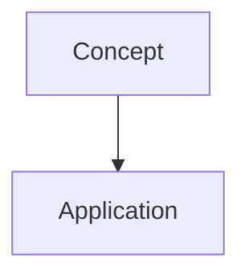

# Lesson NN: <Title>

## Learning Objectives

- By the end of this lesson you will be able to <verb> <object>

## Prerequisites

- <previous lesson / concept, why it is needed>

## Concept

<One concept, direct explanation. No tangents.>

## Visual Reference

<or a table / code block if more apt>

## Hands-On

### Steps

1. <concrete step with the exact command>
2. <step>
3. <step>

### Report Back

<what the learner sends back when done: outputs, screens, blockers>

## Going Deeper

- <depth AFTER the practical block: internals, why it works, what the abstraction hides>

## Interview Lens

**Q: <most common interview question for this topic>**

60-second skeleton: <answer structure, spoken out loud>

## Done When

- [ ] <verifiable outcome 1>
- [ ] <verifiable outcome 2>

## Key Takeaways

- <takeaway 1>
- <takeaway 2>

## Troubleshooting (optional)

| Symptom | Fix |
|---|---|
| <common trap> | <fix> |
