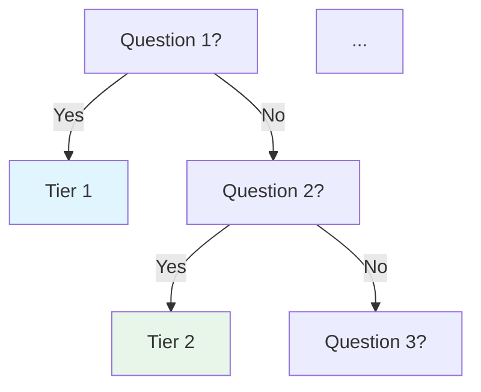

# Checklist Review and Maintenance

Systematic review and update of technical checklists, best-practice documents, and reference materials to keep them current.

## When to Use

- User asks to "review," "audit," "update," or "check" a checklist, best-practices doc, or reference material
- User says "is this checklist still current?" or "what's missing from this document?"
- Periodic maintenance of knowledge base documents (quarterly or when practices shift)
- User maintains checklists in Obsidian vault or similar knowledge base

**Skip for:** one-off document creation, spec writing (use `spec-driven-design`), or code-generated docs (use `construction-docs`).

## Core Workflow

### Step 1 — Load and assess structure

Read the target document and map its structure:

```
- Count sections and items
- Note last-updated date
- Identify cross-references between sections
- Check for referenced files that may not exist
```

Report the baseline stats: "X sections, Y items, last updated Z."

### Step 2 — Identify gaps

Review against current best practices for the domain. Signals to look for:

- **Missing critical areas** — New practices that emerged since last update
- **Outdated recommendations** — Tools, libraries, or patterns that are no longer best practice
- **Incomplete coverage** — Areas mentioned but not fully addressed
- **Broken references** — Links to files or sections that don't exist
- **Cross-reference drift** — Section numbers that no longer match after edits

Use web search or domain knowledge to identify what's missing.

### Step 3 — Batch related updates

Group changes by type to keep the patch count manageable:

**Patch order:**
1. Update the "last updated" date
2. Add items to existing sections (high-value additions)
3. Add entirely new sections (critical gaps)
4. Fix cross-references (after sections are added/removed)
5. Update any "Quick Sanity Check" or summary sections

**Batching rule:** If you're making 3+ related changes to the same section, do them in one patch call. If adding multiple new items to one section, patch once with all items. Use `execute_code` to chain multiple `patch()` calls in a single script — this avoids repeated round-trips.

### Step 4 — Apply updates

Use `patch` for targeted additions and fixes. Use `write_file` only for major reorganizations.

**For adding items to a section:**
```python
patch(file_path,
    'existing_item_text',
    'existing_item_text\n- [ ] **New item** — Description'
)
```

**For adding a new section:**
```python
patch(file_path,
    '---\n\n## Next Section',
    '---\n\n## New Section Name\n\n[content]\n\n---\n\n## Next Section'
)
```

**For fixing cross-references:**
After adding/removing sections, scan for "See Section X" or "§X" references and update them if section numbers shifted.

### Step 5 — Verify and report

After applying all changes:

1. Re-read the file to confirm structure is intact
2. Count new sections and items
3. Report what changed with before/after stats:

```
## ✅ Changes Applied (YYYY-MM-DD)

### Critical Gaps Filled
- [list new sections]

### High-Value Additions
- [list new items added to existing sections]

### Fixes
- [cross-references updated, broken links fixed, etc.]

**File stats:** X → Y lines, A → B sections
```

## Visual Over Tabular for Decision Trees

User preference (validated 2026-08): **Mermaid flowcharts over markdown tables** for decision-making content. When a checklist has a "Which X Am I?" or decision-tree section, render it as a Mermaid `flowchart TD` with color-coded endpoints, not a table.

```markdown
### Which Tier Am I?



Obsidian renders Mermaid natively. Use `style` for color-coded tier endpoints. Apply this to ALL framework variants when updating a checklist family.

## Release / Deployment Checklist Family

The `*-Launch.md` files are **readiness gates** ("is it ready to ship?" — domain-specific quality items), while `release.md` is the **release process** ("how do we execute the ship?" — versioning → rollout → verify → rollback). They are complementary, not duplicates. When the user asks for a release/deployment checklist, propose consolidating all `*-Launch.md` files into the new folder alongside a process checklist — user validated this pattern 2026-08-05 (full consolidation: new `release.md` + move all 3 Launch files).

Current structure:
- `release-checklist/release.md` — 10 sections: Versioning & Artifacts (semver, changelog, tag, SBOM, signing) · Build & CI (reproducible, CI-only path) · Environment Promotion (dev→staging→prod, parity) · Database Migrations (backup, expand-contract, downgrade path) · Rollout Strategy (feature flags, canary, blue-green, progressive) · Pre-Deploy Gates (links to Launch files) · Post-Deploy Verification (smoke, metrics, SLOs) · Rollback (numeric triggers, practiced, <15 min) · Communication · Post-Release Review (RCA, DORA metrics). Plus Quick Sanity Check + 7-tier matrix.
- `release-checklist/API Launch.md`, `Frontend Launch.md`, `Microservice Launch.md` — moved from their domain folders.

**Moving files between checklist folders:**
1. Obsidian `[[wikilinks]]` are name-based — they survive moves, no edits needed.
2. Relative paths (`../api.md`, `../react-js.md`) DO break — fix Sources sections after the move (e.g. `../api-checklist/api.md`).
3. Update `Overview.md` (the "The Checklists" table and "Where the Originals Live" table) to reflect new locations.
4. Verify with `grep -rn` for stale relative references after the move.

## Multi-File Consistency (Checklist Families)

When a checklist has framework-specific variants, any structural change to the parent must cascade. Current families (2026-08):

- **API family** (`api-checklist/`): `api.md` (parent) + `dotnet-api.md` + `fastapi.md` + `fiber-v3-api.md` + `nestjs-api.md` + `rust-axum-api.md` + `spring-boot-api.md`
- **Web family** (`web-checklist/`): `web.md` (parent) + `react-js.md` + `vue-js.md` + `angular.md` + `svelte.md` — all now carry the 7-tier matrix, AI/LLM Integration, and Data Privacy & Compliance sections. **Do NOT touch `react-js-v2.md`** (user: "keep it that way").
- **Release family** (`release-checklist/`): `release.md` (release process) + 3 moved Launch files (readiness gates, see section below)
- **Database family** (`database-checklist/`): `database.md` (parent) + `postgresql.md` (PG 18) + `mongodb.md` (Mongo 8) + `valkey-redis.md` (Valkey/Redis 9) — engine companions mirror the framework-variant pattern, sized to the user's homelab engines (PostgreSQL 18, Valkey 9, MongoDB 8)
- **Horizontal checklists** (`security-checklist/security.md`, `qa-checklist/qa.md`, `ai-checklist/ai.md`): system-wide, framework-agnostic — the deep references that domain and framework checklists link up to

1. **Patch the parent first** (the general checklist)
2. **Fan-out to variants in parallel** — use `delegate_task` with 3 subagents (max) to update variants concurrently. Each subagent adapts the change to its framework's specifics.
3. **Verify consistency** — after fan-out, spot-check that all files have the same structural sections (e.g., all have the scoping matrix, all have the Mermaid diagram).

**Pitfall**: Subagents may not find the exact text to patch if the variant has slightly different wording (e.g., "Multiple modules" vs "Multiple services" in NestJS). Read the exact section text first before patching.

## Creating a New Framework Variant

When the user asks to add a NEW language/framework checklist to a family (validated 2026-08: .NET → `dotnet-api.md`, Python → `fastapi.md`):

1. **Ask which framework the user wants** — propose missing ecosystem gaps (research showed Python/FastAPI was the biggest gap: #1 language, AI/ML-native), let the user pick.
2. **Delegate 3 parallel research subagents**: (a) core stack — framework version, ORM, validation, DI, config, package manager; (b) production practices — auth, testing, observability, resilience, caching, background jobs, versioning; (c) deployment + AI/LLM + data privacy + containerization. Ask for live versions (PyPI/npm/crates), not just names.
3. **Synthesize → present stack summary to user → wait for validation** (consistent with "Research Before Patching").
4. **`write_file` the full checklist in ONE pass**, mirroring the parent's shape: ~20-22 numbered sections, framework-native tools per section, then Quick Sanity Check, then the Scoping Matrix + Mermaid flowchart. Include the AI/LLM Integration and Data Privacy & Compliance sections (they're now standard for all families).
5. **Date stamp** = session date. Cross-link the parent at the bottom (`[[api]]`).

Research references: `references/dotnet-api-stack-2026-08.md`, `references/fastapi-stack-2026-08.md`.

## Horizontal Checklists & the Gate + Link Pattern

Validated 2026-08: when the user asks "what checklist next?", run a **coverage-gap analysis** of the library (map domains covered vs. scattered topics), rank candidates by (a) structural gap, (b) user's homelab/stack relevance, (c) fit with the existing pattern, present the ranked options with a `clarify` — user picks the order.

The library is organized as **domain families** (api, web, batch, microservice, mobile, infra, database) + **horizontal checklists** (release, security, qa, ai) that span all domains. The Launch files are readiness gates; horizontals are deep references. Built 2026-08-05, in user-chosen order:

- `security-checklist/security.md` — 12 sections: threat modeling (STRIDE) → compliance. Complements [[Release]] (process safety) and Launch files (domain readiness).
- `qa-checklist/qa.md` — test strategy: pyramid, unit/integration/E2E, Testcontainers over in-memory fakes, mutation/property/contract testing, CI gates, DORA-informed metrics.
- `ai-checklist/ai.md` — AI/LLM apps: model selection/pinning, prompt versioning, RAG (chunking, hybrid search, re-ranking, citations), agents (bounded loops, sandboxed tools), evals (golden sets, LLM-judge), guardrails, cost control, observability.
- `database-checklist/` — `database.md` (general) + `postgresql.md` + `mongodb.md` + `valkey-redis.md` (engine companions).

**Duplication rule (gate + link):** when a horizontal overlaps an existing checklist, the overlapping items stay as **1-line gates** in the owning checklist with a `→ [[Target]]` link; the horizontal carries the full detail. Example: SBOM/signing/SAST/SCA/secrets exist as gates in `release.md` §1–§3, full detail in `security.md` §5/§9 — both cross-link in Sources. This is a feature (double-check), not duplication. Present this explicitly when the user asks "will this duplicate?"

**Horizontal file shape:** ~10-12 numbered sections, Quick Sanity Check (10 items), 7-tier matrix + Mermaid flowchart, Sources linking back to the checklists it complements. Every new file verified with `grep -c "flowchart TD"` + `grep -c "Checklist Applicability by Tier"` before reporting done.

**Overview.md discipline:** every new checklist/family gets a row in BOTH the "The Checklists" table and "Where the Originals Live" table — same session, not later.

Library architecture detail: `references/checklist-library-architecture-2026-08.md`.

## Research Before Patching

User preference (validated 2026-08): **Don't patch the file until the user validates the approach.** When proposing a new structure (like tier levels or new sections):

1. Research the domain (use web search, delegate research tasks)
2. Present findings with a proposed structure
3. **Wait for user validation** — they may add, remove, or rename items
4. Only then patch the file

The user explicitly said: "dont patch the file yet. find me the project level first" — this is a recurring pattern. Research → Propose → Validate → Patch.

## Scoping Matrix (Mandatory Appendix)

Every checklist should include a **Project Tier Scoping Matrix** at the bottom. This tells the user what applies to their project size so they don't over-engineer. Standard structure:

1. **Usage guide** — how to read the matrix (✅ required / 🟡 recommended / ❌ skip)
2. **Tier Descriptions table** — 7 tiers with team size, user count, lifespan
3. **"Which Tier Am I?" Mermaid flowchart** — visual decision tree (see above)
4. **Checklist Applicability by Tier** — matrix mapping each section to each tier

The 7 tiers (validated with user): 🧪 POC/Spike → 🔧 Prototype/MVP → 🏠 Internal Tool → 🟢 Small Production → 🔵 Medium Production → 🟣 Production Grade → 🔴 Mission-Critical/Regulated.

See `references/software-criticality-frameworks.md` for the research backing these tiers.

## Pitfalls

- **Don't over-patch** — If making 10+ small changes, batch them into an `execute_code` script with multiple `patch()` calls. Each standalone patch is a round-trip.
- **Cross-reference drift** — When adding new sections, existing "See Section 10" references may now point to the wrong section. Always scan for these after structural changes.
- **Wiki-link renames cascade** — If a referenced file is renamed (e.g., `API Launch` → `api`), ALL files referencing it need updating. Use `execute_code` with `read_file` to find all occurrences, then batch-patch.
- **Date stamp first** — Always update the "last updated" date in the first patch. It's easy to forget.
- **Broken references** — Check if the document references other files. If they don't exist, note it in your report but don't create them unless asked.
- **Don't delete without asking** — If you find outdated items, flag them in your report. Let the user decide whether to remove them.
- **Section numbering** — If the document uses numbered sections (## 1., ## 2.), adding a section in the middle requires renumbering all subsequent sections. Consider whether to insert at the end or renumber.
- **Present assessment before changes** — Show the user your gap analysis (🔴 critical / 🟡 high-value / 🟢 minor) before applying patches. Let them review and decide scope.
- **`search_files` on Windows drives can fail** — `search_files` with `F:\...` paths may return IO errors (rg cannot resolve the path). Fallback: run `cd "F:\..." && grep -rn "pattern" --include="*.md" .` in `terminal` — reliable for vault-wide cross-reference scans.

## Integration with Other Skills

- **obsidian** — Use for vault path resolution and basic file operations
- **spec-driven-design** — For generating new design documents from requirements (different task)
- **construction-docs** — For generating docs from built code (different task)
