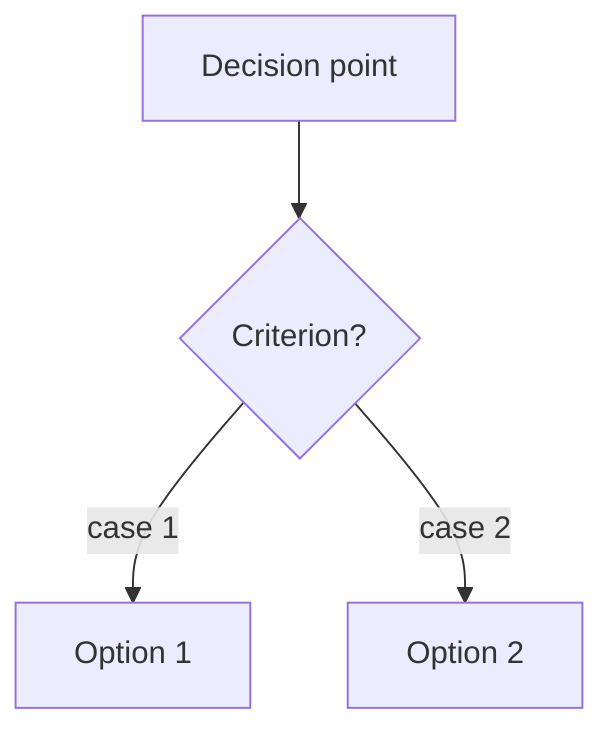

# Answers NN — <Topic> 🗂️

> Pairs with [[NN_Source_Study_Note]]. One-line framing: the senior angle every answer here should carry.

## <Section name — group related questions>

### Q1. <Interview question, verbatim or close to it>
**A:** <Spoken answer, 20–45 seconds when read aloud. Lead with the key point, then 1–2
sentences of support. If the user has a confirmed personal story for this question, do NOT
restate it — write: → Script X in [[Scripts_A_to_F]].>

<!-- Use Mermaid for decision trees / selection criteria; use a small table only for
     2–4 column trade-off comparisons. -->

### Q2. <Next question>
**A:** <Answer>

## ⚡ Rapid-fire recap
- <One-liner — the 5–8 facts to re-say in the last 10 minutes before the interview>
- <One-liner>
- <One-liner>
