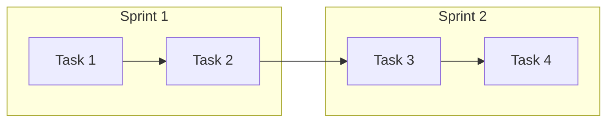

# Phase [N] Implementation Plan — [Project Name]

> **Project:** [Project Name]
> **Version:** 0.1 | **Status:** Draft
> **Last Updated:** [YYYY-MM-DD]

---

## 1. Phase Objective

> [1-2 sentence description of what this phase delivers]

**Success Criteria:** [Measurable outcome]

---

## 2. Scope

| Epic | Stories | Points | Priority |
|------|---------|:------:|:--------:|
| E-01 [Name] | US-XXX, US-XXX | [X] | 🔴 |
| E-02 [Name] | US-XXX, US-XXX | [X] | 🟡 |

---

## 3. Sprint Plan

### Sprint 1: [Focus Area]

| # | Task | Owner | Story | Depends On | Estimate |
|---|------|:-----:|-------|-----------|:--------:|
| 1.1 | [Task description] | Dev | US-XXX | — | Xh |
| 1.2 | [Task description] | Dev | US-XXX | 1.1 | Xh |

**Sprint 1 Total:** ~Xh
**Sprint 1 Deliverables:**
- ✅ [Deliverable 1]
- ✅ [Deliverable 2]

---

## 4. Repository & Branch Strategy

### Repositories

| Repo | Content | Language | Port |
|------|---------|:--------:|:----:|
| `repo-name` | [Description] | [Lang] | [Port] |

### Branch Strategy

| Type | Format | Example |
|------|--------|---------|
| Main | `main` | `main` |
| Develop | `develop` | `develop` |
| Feature | `feat/{sprint}-{description}` | `feat/sprint1-feature-name` |
| Bugfix | `fix/{description}` | `fix/bug-description` |

### Sprint Branches

| Sprint | Branch Name |
|--------|-------------|
| Sprint 1 | `feat/sprint1-[focus]` |
| Sprint 2 | `feat/sprint2-[focus]` |

---

## 5. DevOps Tasks

| # | Task | Priority | Sprint | Details |
|---|------|:--------:|:------:|---------|
| D-001 | [Task] | 🔴 | 1 | [Details] |

---

## 6. Dependency Diagram

---

## 7. Risk Register

| ID | Risk | Probability | Impact | Mitigation | Owner |
|----|------|:-----------:|:------:|-----------|:-----:|
| R-001 | [Risk] | [Low/Med/High] | [Low/Med/High] | [Mitigation] | [Owner] |

---

## 8. Definition of Done

- [ ] [Criterion 1]
- [ ] [Criterion 2]
- [ ] [Criterion 3]

---

## 9. Transition Criteria to Phase [N+1]

1. [Criterion 1]
2. [Criterion 2]

---

## 10. Action Items

| Action ID | Action | Owner | Sprint | Priority | Status |
|-----------|--------|:-----:|:------:|:--------:|:------:|
| PLAN-001 | [Action] | [Owner] | 1 | 🔴 | ⬜ |

---

> **Template Standard:** Based on PMBOK v8, ISO/IEC/IEEE 29148
> **Usage:** Copy this template and fill in project-specific details. Adjust sprint count and task breakdown as needed.
