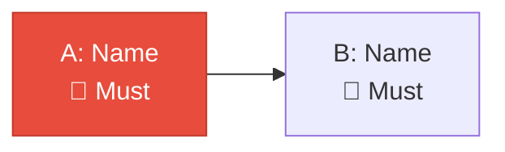

# Phase N — <Phase Name> Plan

> **Status:** ✅ Approved by PO | **Date:** YYYY-MM-DD
> **Based on:** <meeting minute reference>
> **Predecessor:** Phase N-1 (<name>) — ✅/⬜

## 1. Phase Objective

> 1-2 sentences. What does this phase achieve?

## 2. Scope

| Initiative | Name | Priority | Depends On |
|-----------|------|----------|------------|
| A | ... | 🔴/🟡/🟢 | Nothing / B / etc. |

**OUT of scope:**
- ...

## 3. PO Decisions

| Decision | ID | Choice | Rationale |
|----------|-----|--------|-----------|
| ... | DEC-XXX | ... | ... |

## 4. Execution Order

| Sprint | Initiative | What Ships | Owner |
|--------|-----------|------------|-------|
| Sprint N | A | ... | DevOps/Dev |

## 5. Initiative Details

### Initiative A: <Name>

> **Priority:** 🔴 Must Have

**Deliverables:**
| Deliverable | Description |
|------------|-------------|
| ... | ... |

## 6. New Ports & Domains

| Service | Port | Domain | Initiative |
|---------|------|--------|------------|
| ... | ... | ... | ... |

## 7. Action Items

| ID | Action | Owner | Priority | Depends On |
|----|--------|-------|----------|------------|
| P2-001 | ... | ... | 🔴 | — |

## 8. Definition of Done

- [ ] ...
- [ ] ...

## 9. Next Phase Transition Criteria

1. ...
2. ...

## Related Documents

| Document | Relationship |
|----------|-------------|
| [[...]] | ... |
